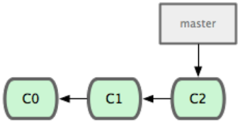
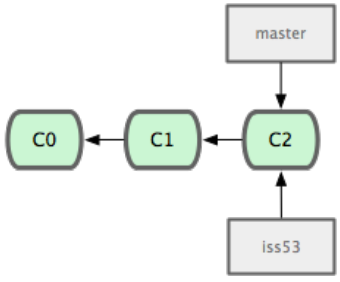
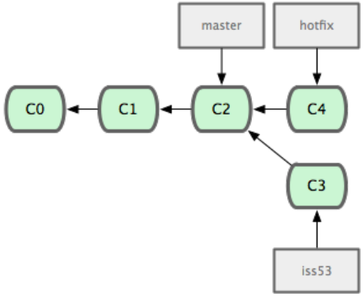
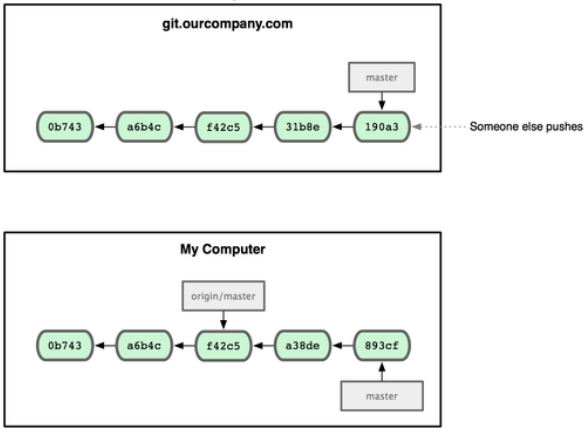

Getting Started
===============

This chapter will be about getting started with Git. We will begin at the beginning by explaining some background on version control tools, then move on to how to get Git running on your system and finally how to get it setup to start working with. At the end of this chapter you should understand why Git is around, why you should use it and you should be all setup to do so.

About Version Control
---------------------

What is version control, and why should you care? Version control is a system that records changes to a file or set of files overtime so that you can recall specific versions later. For the examples in this book you will use software source code as the files being version controlled, though in reality you can do this with nearly any type of file on a computer.

If you are a graphic or web designer and want to keep every version of an image or layout (which you would most certainly want to), a Version Control System (VCS) is a very wise thing to use. It allows you to revert files back to a previous state, revert the entire project back to a previous state, compare changes over time, see who last modified something that might be causing a problem, who introduced an issue and when, and more. Using a VCS also generally means that if you screw things up or lose files, you can easily recover. In addition, you get all this for very little overhead.

### Local Version Control Systems

Many people's version-control method of choice is to copy files into another directory (perhaps a time-stamped directory, if they're clever). This approach is very common because it is so simple, but it is also incredibly error prone. It is easy to forget which directory you're in and accidentally write to the wrong file or copy over files you don't mean to.

To deal with this issue, programmers long ago developed local VCSs that had a simple database that kept all the changes to files under revision control (see Figure 1.1).


Figure 1.1 Local version control diagram

One of the more popular VCS tools was a system called rcs, which is still distributed with many computers today. Even the popular Mac OS X operating system includes the rcs command when you install the Developer Tools. This tool basically works by keeping patch sets (that is, the differences between files) from one change to another in a special format on disk; it can then re-create what any file looked like at any point in time by adding up all the patches.
### Centralized Version Control Systems

The next major issue that people encounter is that they need to collaborate with developers on other systems. To deal with this problem, Centralized Version Control Systems (CVCSs) were developed. These systems, such as CVS, Subversion and Perforce, have a single server that contains all the versioned files, and a number of clients that check out files from that central place. For many years, this has been the standard for version control (see Figure 1.2).


Figure 1.2 Centralized version control diagram

This setup offers many advantages, especially over local VCSs. For example, everyone knows to a certain degree what everyone else on the project is doing. Administrators have fine-grained control over who can do what; and it's far easier to administer a CVCS than it is to deal with local databases on every client.

However, this setup also has some serious downsides. The most obvious is the single point of failure that the centralized server represents. If that server goes down for an hour, then during that hour nobody can collaborate at all or save versioned changes to anything they're working on. If the hard disk the central database is on becomes corrupted, and proper backups haven't been kept, you lose absolutely everything—the entire history of the project except what ever single snapshots people happen to have on their local machines. Local VCS systems suffer from this same problem—whenever you have the entire history of the project in a single place, you risk losing everything.

### Distributed Version Control Systems

This is where Distributed Version Control Systems (DVCSs) step in. In a DVCS     (such as Git, Mercurial, Bazaar or Darcs), clients don't just check out the     latest snapshot of the files: they fully mirror the repository. Thus if any     server dies, and these systems were collaborating via it, any of the client     repositories can be copied back up to the server to restore it. Every     checkout is really a full backup of all the data (see Figure 1.3).


Figure 1.3 Distributed version control diagram

Furthermore, many of these systems deal pretty well with having several remote repositories they can work with, so you can collaborate with different groups of people in different ways simultaneously with in the same project. This allows you to setup several types of workflows that aren't possible in centralized systems, such as hierarchical models.

A Short History of Git
----------------------

As with many great things in life, Git began with a bit of creative destruction and fiery controversy. The Linux kernel is an open source software project of fairly large scope. For most of the lifetime of the Linux kernel maintenance (1991-2002), changes to the software were passed around as patches and archived files.

In 2002, the Linux kernel project began using a proprietary DVCS system called
BitKeeper.

In 2005, the relationship between the community that developed the Linux kernel and the commercial company that developed BitKeeper broke down, and the tool's free-of-charge status was revoked. This prompted the Linux development community (and in particular Linus Torvalds, the creator of Linux) to develop their own tool based on some of the lessons they learned while using BitKeeper. Some of the goals of the new system were as follows:
-   Speed
-   Simple design
-   Strong support for non-linear development (thousands of parallel branches)
-   Fully distributed
-   Able to handle large projects like the Linux kernel efficiently (speed and data size)

Since its birth in 2005, Git has evolved and matured to be easy to use and yet
retain these initial qualities. It's incredibly fast, it's very efficient with
large projects, and it has an incredible branching system for non-linear
development (See Chapter 3).

Git Basics
----------

So, what is Git in a nutshell? This is an important section to absorb, because if you understand what Git is and the fundamentals of how it works, then using Git effectively will probably be much easier for you. As you learn Git, try to clear your mind of the things you may know about other VCSs, such as Subversion and Perforce; doing so will help you avoid subtle confusion when using the tool. Git stores and thinks about information much differently than these other systems, even though the user interface is fairly similar; understanding those differences will help prevent you from becoming confused while using it.

### Snapshots, Not Differences

The major difference between Git and any other VCS (Subversion and friends included) is the way Git thinks about its data. Conceptually, most other systems store information as a list of file-based changes. These systems (CVS, Subversion, Perforce, Bazaar, and so on) think of the information they keep as a set of files and the changes made to each file over time, as illustrated in Figure 1.4.


Figure 1.4 Other systems tend to store data as changes to a base version of each file.

Git doesn't think of or store its data this way. Instead, Git thinks of its data more like a set of snapshots of a mini filesystem. Every time you commit, or save the state of your project in Git, it basically takes a picture of what all your files look like at that moment and stores a reference to that snapshot. To bee fficient, if files have not changed, Git doesn't store the file again—just a link to the previous identical file it has already stored. Git thinks about its data more like Figure 1.5.


Figure 1.5 Git stores data as snapshots of the project over time.

This is an important distinction between Git and nearly all other VCSs. It makes Git reconsider almost every aspect of version control that most other systems copied from the previous generation. This makes Git more like a mini filesystem with some incredibly powerful tools built on top of it, rather than simply a VCS. We'll explore some of the benefits you gain by thinking of your data this way when we cover Git branching in Chapter 3.

### Nearly Every Operation Is Local

Most operations in Git only need local files and resources to operate generally no information is needed from another computer on your network. If you're used to a CVCS where most operations have that network latency overhead, this aspect of Git will make you think that the gods of speed have blessed Git with unworldly powers. Because you have the entire history of the project right there on your local disk, most operations seem almost instantaneous.

For example, to browse the history of the project, Git doesn't need to go out to the server to get the history and display it for you—it simply reads it directly from your local database. This means you see the project history almost instantly. If you want to see the changes introduced between the current version of a file and the file a month ago, Git can look up the file a month ago and do a local difference calculation, instead of having to either ask a remote server to do it or pull an older version of the file from the remote server to do it locally.

This also means that there is very little you can't do if you're offline or off VPN. If you get on an airplane or a train and want to do a little work, you can commit happily until you get to a network connection to upload. If you go home and can't get your VPN client working properly, you can still work. In many other systems, doing so is either impossible or painful. In Perforce, for example, you can't do much when you aren't connected to the server; and in Subversion and CVS, you can edit files, but you can't commit changes to your database (because your database is offline). This may not seem like a huge deal, but you may be surprised what a big difference it can make.

### Git Has Integrity

Everything in Git is check-summed before it is stored and is then referred to by that checksum. This means it's impossible to change the contents of any file or directory without Git knowing about it. This functionality is built into Git at the lowest levels and is integral to its philosophy. You can't lose information in transit or get file corruption without Git being able to detect it. The mechanism that Git uses for this check summing is called a SHA–1 hash. This is a 40-character string composed of hexadecimal characters (0-9 and a-f) and calculated based on the contents of a file or directory structure in Git. A SHA–1 hash looks something like this:

```
24b9da6552252987aa493b52f8696cd6d3b00373
```

You will see these hash values all over the place in Git because it uses them so much. In fact, Git stores everything not by file name but in the Git database addressable by the hash value of its contents.

### Git Generally Only Adds Data

When you do actions in Git, nearly all of them only add data to the Git database. It is very difficult to get the system to do anything that is not undoable or to make it erase data in any way. As in any VCS, you can lose or mess up changes you haven't committed yet; but after you commit a snapshot into Git, it is very difficult to lose, especially if you regularly push your database to another repository.

This makes using Git a joy because we know we can experiment without the danger of severely screwing things up. For a more in-depth look at how Git stores its data and how you can recover data that seems lost, see "Under the Covers" in Chapter 9.

### The Three States

Now, pay attention. This is the main thing to remember about Git if you want the rest of your learning process to go smoothly. Git has three main states that your files can reside in: committed, modified, and staged. Committed means that the data is safely stored in your local database. Modified means that you have changed the file but have not committed it to your database yet. Staged means that you have marked a modified file in its current version to go into your next commit snapshot.

This leads us to the three main sections of a Git project: the Git directory, the working directory, and the staging area.


Figure 1.6 Working directory, staging area, and git directory

The Git directory is where Git stores the metadata and object database for your project. This is the most important part of Git, and it is what is copied when you clone a repository from another computer.

The working directory is a single checkout of one version of the project. These files are pulled out of the compressed database in the Git directory and placed on disk for you to use or modify.

The staging area is a simple file, generally contained in your Git directory, that stores information about what will go into your next commit. It's sometimes referred to as the index, but it's becoming standard to refer to it as the staging area.

The basic Git workflow goes something like this:
1.  You modify files in your working directory.
2.  You stage the files, adding snapshots of them to your staging area.
3.  You do a commit, which takes the files as they are in the staging area and stores that snapshot permanently to your Git directory.

If a particular version of a file is in the git directory, it's considered committed. If it's modified but has been added to the staging area, it is staged. And if it was changed since it was checked out but has not been staged, it is modified. In Chapter 2, you'll learn more about these states and how you can either take advantage of them or skip the staged part entirely.

Installing Git
--------------

Let's get into using some Git. First things first—you have to install it. You can get it a number of ways; the two major ones are to install it from source or to install an existing package for your platform.

### Installing from Source

Some people may instead find it useful to install Git from source, because you'll get the most recent version. The binary installers tend to be a bit behind, though as Git has matured in recent years, this has made less of a difference.

If you do want to install Git from source, you need to have the following libraries that Git depends on: autotools, curl, zlib, openssl, expat, and libiconv. For example, if you're on a system that has dnf (such as Fedora) or apt-get (such as a Debian-based system), you can use one of these commands to install the minimal dependencies for compiling and installing the Git binaries:

```
$ sudo dnf install dh-autoreconf curl-devel expat-devel gettext-devel
openssl-devel perl-devel zlib-devel

$ sudo apt-get install dh-autoreconf libcurl4-gnutls-dev libexpat1-dev gettext
libz-dev libssl-dev

In order to be able to add the documentation in various formats (doc, html,
info), these additional dependencies are required:

$ sudo dnf install asciidoc xmlto docbook2X

$ sudo apt-get install asciidoc xmlto docbook2x
``` 

| Note | Users of RHEL and RHEL-derivatives like CentOS and Scientific Linux will have to [enable the EPEL repository](https://fedoraproject.org/wiki/EPEL#How_can_I_use_these_extra_packages.3F) to download the docbook2X package. |
|------|-----------------------------------------------------------------------------------------------------------------------------------------------------------------------------------------------------------------------------|

### Installing on Linux

If you want to install Git on Linux via a binary installer, you can generally do so through the basic package-management tool that comes with your distribution. If you're on Fedora, you can use yum:

```
$ yum install git-core 
```


Or if you're on a Debian-based distribution like Ubuntu, try apt-get:

```
$ apt-get install git-core
```

### Installing on Mac

There are two easy ways to install Git on a Mac. The easiest is to use the graphical Git installer, which you can download from the SourceForge page (see Figure 1.7): [https://sourceforge.net/projects/git-osx-installer/](https://sourceforge.net/projects/git-osx-installer/files/)

The other major way is to install Git via Brew (<https://brew.sh/>).

You don't have to add all the extras, but you'll probably want to include +svn in case you ever have to use Git with Subversion repositories (see Chapter 8).

### Installing on Windows

There are also a few ways to install Git on Windows. The most official build is available for download on the Git website. Just go to <https://git-scm.com/download/win> and the download will start automatically. Note that this is a project called Git for Windows, which is separate from Git itself; for more information on it, go to [https://gitforwindows.org](https://gitforwindows.org/).

To get an automated installation you can use the [Git Chocolatey package](https://chocolatey.org/packages/git). Note that the Chocolatey package is community maintained.

Another easy way to get Git installed is by installing GitHub Desktop. The installer includes a command line version of Git as well as the GUI. It also works well with PowerShell, and sets up solid credential caching and sane CRLF settings. We'll learn more about those things a little later, but suffice it to say they're things you want. You can download this from the [GitHub Desktop website](https://desktop.github.com/).

First-Time Git Setup
--------------------

Now that you have Git on your system, you'll want to do a few things to customize your Git environment. You should have to do these things only once; they'll stick around between upgrades. You can also change them at any time by running through the commands again.

Git comes with a tool called git config that lets you get and set configuration variables that control all aspects of how Git looks and operates. These variables can be stored in three different places:

-   ```/etc/gitconfig```
file: Contains values for every user on the system and all their repositories. If you pass the option--system to git config, it reads and writes from this file specifically.

-   ```.gitconfig```
file: Specific to your user. You can make Git read and write to this file specifically by passing the ```--global```
option.

-   config file in the git directory (that is, ```.git/config```) of whatever repository you're currently using: Specific to that single repository. Each level overrides values in the previous level, so values in ```.git/config```
trump those in ```/etc/gitconfig```.

On Windows systems, Git looks for the .gitconfig file in the ```$HOME```
directory (```C:\Documents and Settings\$USER```
for most people). It also still looks for ```/etc/gitconfig```, although it's relative to the MSys root, which is wherever you decide to install Git on your Windows system when you run the installer.

### Your Identity

The first thing you should do when you install Git is to set your user name and e-mail address. This is important because every Git commit uses this information, and it's immutably baked into the commits you pass around:

```
$ git config --global user.name "John Doe"

$ git config --global user.email johndoe@example.com
```

Again, you need to do this only once if you pass the ```--global```
option, because then Git will always use that information for anything you do on that system. If you want to override this with a different name or e-mail address for specific projects, you can run the command without the ```--global```
option when you're in that project.

### Your Editor

Now that your identity is set up, you can configure the default text editor that will be used when Git needs you to type in a message. By default, Git uses your system's default editor, which is generally Vi or Vim. If you want to use a different text editor, such as Emacs, you can do the following:

```
$ git config --global core.editor emacs 
```

### Your Diff Tool

Another useful option you may want to configure is the default diff tool to use to resolve merge conflicts. Say you want to use vim diff:

```
$ git config --global merge.tool vimdiff 
```

Git accepts kdiff3, tkdiff, meld, xxdiff, emerge, vimdiff, gvimdiff, ecmerge, and opendiff as valid merge tools. You can also set up a custom tool; see Chapter 7 for more information about doing that.

### Checking Your Settings

If you want to check your settings, you can use the git config ```--list``` command to list all the settings Git can find at that point:

```
$ git config --list

user.name=Hoang Thanh Son

user.email=wingadium1@gmail.com

color.status=auto

color.branch=auto

color.interactive=auto

color.diff=auto ... 
```

You may see keys more than once, because Git reads the same key from different files (```/etc/gitconfig```
and ```.gitconfig```, for example). In this case, Git uses the last value for each unique key it sees. You can also check what Git thinks a specific key's value is by typing git config key:

```
$ git config user.name Hoang Thanh Son 
```

Getting Help
--------------------

If you ever need help while using Git, there are three ways to get the manual page (manpage) help for any of the Git commands:

```
$ git help <verb> $ git <verb> --help $ man git-<verb> 
```

For example, you can get the manpage help for the config command by running

```
$ git help config 
```

These commands are nice because you can access them anywhere, even offline. If the man pages and this book aren't enough and you need in-person help, you can try the ```#git```
or ```#github```
channel on the Freenode IRC server(irc.freenode.net). These channels are regularly filled with hundreds of people who are all very knowledgeable about Git and are often willing to help.

Summary
--------------------

You should have a basic understanding of what Git is and how it's different from the CVCS you may have been using. You should also now have a working version of Git on your system that's set up with your personal identity. It's now time to learn some Git basics.

If you can read only one chapter to get going with Git, this is it. This chapter covers every basic command you need to do the vast majority of the things you'll eventually spend your time doing with Git. By the end of the chapter, you should be able to configure and initialize a repository, begin and stop tracking files, and stage and commit changes. We 'll also show you how to setup Git to ignore certain files and file patterns, how to undo mistakes quickly and easily, how to browse the history of your project and view changes between commits, and how to push and pull from remote repositories.

Git Basics 
==========

Getting a Git Repository 
------------------------ 

You can get a Git project using two main approaches. The first takes an existing project or directory and imports it into Git. The second clones an existing Git repository from another server.

### Initializing a Repository in an Existing Directory

If you're starting to track an existing project in Git, you need to go to the project's directory and type

```
$ git init 
```

This creates a new sub directory named .git that contains all of your necessary repository files — a Git repository skeleton. At this point, nothing in your project is tracked yet. (See Chapter 9 for more information about exactly what files are contained in the ```.git``` directory you just created.)

If you want to start version-controlling existing files (as opposed to an empty directory), you should probably begin tracking those files and do an initial commit. You can accomplish that with a few ```git add```
commands that specify the files you want to track, followed by a commit:

```
$ git add *.c

$ git add README

$ git commit m ‘initial project version'
```

We'll go over what these commands do in just a minute. At this point, you have a Git repository with tracked files and an initial commit.

### Cloning an Existing Repository

If you want to get a copy of an existing Git repository — for example, a project you'd like to contribute to — the command you need is git clone. If you're familiar with other VCS systems such as Subversion, you'll notice that the command is clone and not checkout. This is an important distinction — Git receives a copy of nearly all data that the server has. Every version of every file for the history of the project is pulled down when you run git clone. In fact, if your server disk gets corrupted, you can use any of the clones on any client to set the server back to the state it was in when it was cloned (you may lose some server-side hooks and such, but all the versioned data would be there—see Chapter 4 for more details). You clone a repository with git clone [url]. For example, if you want to clone the Ruby Git library called Grit, you can do so like this:

```
$ git clone git://github.com/wingadium1/grit.git 
```

That creates a directory named ***grit***, initializes a .git directory inside it, pulls down all the data for that repository, and checks out a working copy of the latest version. If you go into the new grit directory, you'll see the project files in there, ready to be worked on or used. If you want to clone the repository into a directory named something other than grit, you can specify that as the next command-line option:

```
$ git clone git://github.com/wingadium1/grit.git mygrit
```

That command does the same thing as the previous one, but the target directory is called mygrit. Git has a number of different transfer protocols you can use. The previous example uses the ```git://``` protocol, but you may also see ```http(s)://``` or ```user@server:/path.git```, which uses the SSH transfer protocol. Chapter 4 will introduce all of the available options the server can set up to access your Git repository and the pros and cons of each.

Recording Changes to the Repository
--------------------

You have a bona fide Git repository and a checkout or working copy of the files for that project. You need to make some changes and commit snapshots of those changes into your repository each time the project reaches a state you want to record.

Remember that each file in your working directory can be in one of two states: tracked or untracked. Tracked files are files that were in the last snapshot; they can be unmodified, modified, or staged. Untracked files are everything else - any files in your working directory that were not in your last snapshot and are not in your staging area. When you first clone a repository, all of your files will be tracked and unmodified because you just checked them out and haven't edited anything.

As you edit files, Git sees them as modified, because you've changed them since your last commit. You stage these modified files and then commit all your staged changes, and the cycle repeats. This lifecycle is illustrated in Figure 2.1.


Figure 2.1 The lifecycle of the status of your files

### Checking the Status of Your Files

The main tool you use to determine which files are in which state is the git status command. If you run this command directly after a clone, you should see something like this:
```
$ git status

#On branch master nothing to commit (working directory clean)
```
This means you have a clean working directory—in other words, there are no tracked and modified files. Git also doesn't see any untracked files, or they would be listed here. Finally, the command tells you which branch you're on. For now, that is always master, which is the default; you won't worry about it there. Then next chapter will go over branches and references in detail. Let's say you add a new file to your project, a simple README file. If the file didn't exist before, and you run git status, you see your untracked file like so:
```
$ vim README

$ git status
# On branch master
# Untracked files:
# (use "git add <file>..." to include in what will be committed)
#
# README
nothing added to commit but untracked files present (use "git add" to track)
```
You can see that your new README file is untracked, because it's under the "Untracked files" heading in your status output. Untracked basically means that Git sees a file you didn't have in the previous snapshot (commit); Git won't start including it in your commit snapshots until you explicitly tell it to do so. It does this so you don't accidentally begin including generated binary files or other files that you did not mean to include. You do want to start including README, so let's start tracking the file.

### Tracking New Files

In order to begin tracking a new file, you use the command git add. To begin tracking the README file, you can run this:
```
$ git add README
```
If you run your status command again, you can see that your README file is now tracked and staged:
```
$ git status
# On branch master
# Changes to be committed:
# (use "git reset HEAD <file>..." to unstage)
#
# new file: README
#
```
You can tell that it's staged because it's under the "Changes to be committed" heading. If you commit at this point, the version of the file at the time you ran git add is what will be in the historical snapshot. You may recall that when you ran git init earlier, you then ran git add (files) — that was to begin tracking files in your directory. The git add command takes a path name for either a file or a directory; if it's a directory, the command adds all the files in that directory recursively.

### Staging Modified Files

Let's change a file that was already tracked. If you change a previously tracked file called benchmarks.rb and then run your status command again, you get something that looks like this:
```
$ git status
# On branch master
# Changes to be committed:
# (use "git reset HEAD <file>..." to unstage)
#
# new file: README
#
# Changed but not updated:
# (use "git add <file>..." to update what will be committed)
#
# modified: benchmarks.rb
#
```
The benchmarks.rb file appears under a section named "Changed but not updated" — which means that a file that is tracked has been modified in the working directory but not yet staged. To stage it, you run the git add command (it's a multipurpose command—you use it to begin tracking new files, to stage files, and to do other things like marking merge-conflicted files as resolved). Let's run git add now to stage the benchmarks.rb file, and then run git status again:
```
$ git add benchmarks.rb

$ git status
# On branch master
# Changes to be committed:
# (use "git reset HEAD <file>..." to unstage)
#
# new file: README
# modified: benchmarks.rb
#
```
Both files are staged and will go into your next commit. At this point, suppose you remember one little change that you want to make in benchmarks.rb before you commit it. You open it again and make that change, and you're ready to commit. However, let's run git status one more time:
```
$ vim benchmarks.rb

$ git status
# On branch master
# Changes to be committed:
# (use "git reset HEAD <file>..." to unstage)
#
# new file: README
# modified: benchmarks.rb
#
# Changed but not updated:
# (use "git add <file>..." to update what will be committed)
#
# modified: benchmarks.rb
#
```
What the heck? Now benchmarks.rb is listed as both staged and unstaged. How is that possible? It turns out that Git stages a file exactly as it is when you run the git add command. If you commit now, the version of benchmarks.rb as it was when you last ran the git add command is how it will go into the commit, not the version of the file as it looks in your working directory when you run git commit. If you modify a file after you run git add, you have to run git add again to stage the latest version of the file:
```
$ git add benchmarks.rb

$ git status
# On branch master
# Changes to be committed:
# (use "git reset HEAD <file>..." to unstage)
#
# new file: README
# modified: benchmarks.rb
#
```
### Ignoring Files

Often, you'll have a class of files that you don't want Git to automatically add or even show you as being untracked. These are generally automatically generated files such as log files or files produced by your build system. In such cases, you can create a file listing patterns to match them named .gitignore. Here is an example .gitignore file:
```
$ cat .gitignore *.[oa] *˜
```
The first line tells Git to ignore any files ending in ```.o``` or ```.a``` — object and archive files that may be the product of building your code. The second line tells Git to ignore all files that end with a tilde ( ), which is used by many text editors such as Emacs to mark temporary files. You may also include a log, tmp, or pid directory; automatically generated documentation; and soon. Setting up a ```.gitignore``` file before you get going is generally a good idea so you don't accidentally commit files that you really don't want in your Git repository. The rules for the patterns you can put in the .gitignore file are as follows: 
- Blank lines or lines starting with ```#``` are ignored.
- Standard glob patterns work.
- You can end patterns with a forward slash (/) to specify a directory.
- You can negate a pattern by starting it with an exclamation point (!). 
Glob patterns are like simplified regular expressions that shells use. An asterisk (*) matches zero or more characters; [abc] matches any character inside the brackets (in this case a, b, or c); a question mark (?) matches a single character; and brackets enclosing characters seperated by a hyphen([0-9]) matches any character between them (in this case 0 through 9). 
Here is another example .gitignore file:

```
# a comment this is ignored 
*.a 
# no .a files 
!lib.a
# but do track lib.a, even though you're ignoring .a files above 
/TODO
# only ignore the root TODO file, not subdir/TODO 
build/
# ignore all files in the build/ directory 
doc/*.txt
# ignore doc/notes.txt, but not doc/server/arch.txt
```
### Viewing Your Staged and Unstaged Changes
If the ```git status``` command is too vague for you — you want to know exactly what youchanged,notjustwhichfileswerechanged—youcanusethegit diffcommand. We'll cover git diff in more detail later; but you'll probably use it most often to answer these two questions: What have you changed but not yet staged? And what have you staged that you are about to commit? Although git status answers those questions very generally, git diff shows you the exact lines added and removed — the patch, as it were. 
Let's say you edit and stage the ```README``` file again and then edit the benchmarks.rb file without staging it. If you run your status command, you once again see something like this:

```
$ git status 
# On branch master 
# Changes to be committed: 
#   (use "git reset HEAD <file>..." to unstage)
# 
# new file: README 
# 
# Changed but not updated: 
#   (use "git add <file>..." to update what will be committed) 
# 
# modified: benchmarks.rb #
```
To see what you've changed but not yet staged, type git diff with no other arguments:
```
$ git diff
diff --git a/benchmarks.rb b/benchmarks.rb 
index 3cb747f..da65585 100644 
--- a/benchmarks.rb 
+++ b/benchmarks.rb 
@@ -36,6 +36,10 @@ def main 
                @commit.parents[0].parents[0].parents[0] 
            end

+           run_code(x, 'commits 1') do 
+               git.commits.size 
+           end 
+           run_code(x, 'commits 2') do 
                log = git.commits('master', 15) 
                log.size
```
That command compares what is in your working directory with what is in your staging area. The result tells you the changes you've made that you haven't yet staged. 
If you want to see what you've staged that will go into your next commit, you can use git diff ```-cached```. (In Git versions 1.6.1 and later, you can also use git diff ```-staged```, which may be easier to remember.) This command compares your staged changes to your last commit:
```
$ git diff --cached 
diff --git a/README b/README 
new file mode 100644 
index 0000000..03902a1 
--- /dev/null 
+++ b/README2 
@@ -0,0 +1,5 @@ 
+ grit 
+ by Tom Preston-Werner, Chris Wanstrath 
+ http://github.com/mojombo/grit 
+ 
+ Grit is a Ruby library for extracting information from a Git repository
```
It's important to note that git diff by itself doesn't show all changes made since your last commit — only changes that are still unstaged. This can be confusing, because if you've staged all of your changes, git diff will give you no output.

For another example, if you stage the benchmarks.rb file and then edit it, you can use git diff to see the changes in the file that are staged and the changes that are unstaged:
```
$ git add benchmarks.rb 
$ echo '# test line' >> benchmarks.rb 
$ git status 
# On branch master 
# 
# Changes to be committed: 
# 
# modified: benchmarks.rb 
# 
# Changed but not updated: 
# 
# modified: benchmarks.rb 
#
```
Now you can use git diff to see what is still unstaged
```
$ git diff 
diff --git a/benchmarks.rb b/benchmarks.rb 
index e445e28..86b2f7c 100644 
--- a/benchmarks.rb 
+++ b/benchmarks.rb 
@@ -127,3 +127,4 @@ end 
    main()

    ##pp Grit::GitRuby.cache_client.stats 
+  
# test line
```
and git diff --cached to see what youve staged so far: 
```
$ git diff --cached 
diff --git a/benchmarks.rb b/benchmarks.rb 
index 3cb747f..e445e28 100644 
--- a/benchmarks.rb 
+++ b/benchmarks.rb 
@@ -36,6 +36,10 @@ def main 
                @commit.parents[0].parents[0].parents[0] 
            end

+           run_code(x, 'commits 1') do 
+               git.commits.size 
+           end 
+           run_code(x, 'commits 2') 
                do log = git.commits('master', 15) 
                log.size
```
### Committing Your Changes 
Now that your staging area is setup the way you want it, you can commit your changes. Remember that any thing that is still unstaged — any files you have created or modified that you haven't run git add on since you edited them — won't go into this commit.

They will stay as modified files on your disk. In this case, the last time you ran git status, you saw that everything was staged, so you're ready to commit your changes. The simplest way to commit is to type git commit:

```
$ git commit
```

Doing so launches your editor of choice. (This is set by your shell's ```$EDITOR``` environment variable — usually vim or emacs, although you can configure it with whatever you want using the ```git config --global core.editor ``` command as you saw in Chapter 1.

The editor displays the following text (this example is a Vim screen):

```
# Please enter the commit message for your changes. Lines starting
# with '#' will be ignored, and an empty message aborts the commit.
# On branch master
# Changes to be committed:
#   (use "git reset HEAD <file>..." to unstage)
# 
#       new file: README
#       modified: benchmarks.rb 
˜ 
˜ 
˜ 
".git/COMMIT_EDITMSG" 10L, 283C
```

You can see that the default commit message contains the latest output of the git status command commented out and one empty line on top. You can remove these comments and type your commit message, or you can leave them there to help you remember what you're committing. (For a nevenmore explicit reminder of what you've modified, you can pass the ```-v``` option to git commit. Doing so also puts the diff of your change in the editor so you can see exactly what you did.) When you exit the editor, Git creates your commit with that commit message (with the comments and diff stripped out). 
Alternatively, you can type your commit message inline with the commit command by specifying it after a ```-m``` flag, like this:
```
$ git commit -m "Story 182: Fix benchmarks for speed" 
[master]: created 463dc4f: "Fix benchmarks for speed" 
 2 files changed, 3 insertions(+), 0 deletions(-) 
 create mode 100644 README
```
Now you've created your first commit! You can see that the commit has given you some output about itself: which branch you committed to (master), what SHA–1 checksumthecommithas(463dc4f),howmanyfileswerechanged,andstatisticsabout lines added and removed in the commit. 
Remember that the commit records the snapshot you set up in your staging area. Anything you didn't stage is still sitting there modified; you can do another commit to add it to your history. Every time you perform a commit, you're recording a snapshot of your project that you can revert to or compare to later.

### Skipping the Staging Area 
Although it can be amazingly useful for crafting commits exactly how you want them, the staging area is sometimes a bit more complex than you need in your workflow. If you want to skip the staging area, Git provides a simple shortcut. Providing the ```-a``` option to the ```git commit``` command makes Git automatically stage every file that is already tracked before doing the commit, letting you skip the ```git add``` part:
```
$ git status
# On branch master
# 
# Changed but not updated:
# 
# modified: benchmarks.rb
# 
$ git commit -a -m 'added new benchmarks' 
[master 83e38c7] added new benchmarks
 1 files changed, 5 insertions(+),
 0 deletions(-)
```
Notice how you don't have to run git add on the benchmarks.rb file in this case before you commit.

### RemovingFiles 
To remove a file from Git, you have to remove it from your tracked files (more accurately, remove it from your staging area) and then commit. The ```git rm``` command does that and also removes the file from your working directory so you don't see it as an untracked file next time around.

If you simply remove the file from your working directory, it shows up under the "Changed but not updated" (that is, unstaged) area of your ```git status``` output:
```
$ rm grit.gemspec $ git status
# On branch master
# 
# Changed but not updated:
# (use "git add/rm <file>..." to update what will be committed)
# 
# deleted: grit.gemspec 
#
```
Then, if you run ```git rm```, it stages the file's removal:
```
$ git rm grit.gemspec rm 'grit.gemspec' $ git status
# On branch master
# 
# Changes to be committed:
#    (use "git reset HEAD <file>..." to unstage)
# 
#       deleted: grit.gemspec 
#
```

The next time you commit, the file will be gone and no longer tracked. If you modified the file and added it to the index already,you must force the removal with the ```-f``` option. This is a safety feature to prevent accidental removal of data that hasn't yet been recorded in a snapshot and that can't be recovered from Git. 

Another useful thing you may want to do is to keep the file in your working tree but remove it from your staging area. In other words, you may want to keep the file on your hard drive but not have Git track it anymore. This is particularly useful if you forgot to add something to your .gitignore file and accidentally added it, like a large log file or a bunch of .a compiled files. To do this, use the ```--cached``` option:

```
$ git rm --cached readme.txt
```
You can pass files, directories, and file-glob patterns to the git rm command. That means you can do things such as
``` 
$ git rm log/\*.log 
```
Note the backslash (\) in front of the *. This is necessary because Git does its own file name expansion in addition to your shell's file name expansion. This command removes all files that have the ```.log``` extension in the log/ directory. Or, you can do something like this:
```
$ git rm \*.txt
```
This command removes all files that end with ```.txt```

### Moving Files 
Unlike many other VCS systems, Git doesn't explicitly track file movement. If you rename a file in Git, no metadata is stored in Git that tells it you renamed the file. However, Git is pretty smart about figuring that out after the fact — we'll deal with detecting file movement a bit later. Thus it's a bit confusing that Git has a ```mv``` command. If you want to rename a file in Git, you can run something like

```
$ git mv file_from file_to
```

and it works fine. In fact, if you run something like this and look at the status, you'll see that Git considers it a renamed file:
```
$ git mv README.txt README $ git status
# On branch master
# Your branch is ahead of 'origin/master' by 1 commit.
# 
# Changes to be committed:
# (use "git reset HEAD <file>..." to unstage)
# 
# renamed: README.txt -> README #
```
However, this is equivalent to running something like this:
```
$ mv README.txt README
$ git rm README.txt
$ git add README
```
Git figures out that it's are name implicitly, so it doesn't matter if you rename a file that way or with the mv command. The only real difference is that mv is one command instead of three — it's a convenience function. More important, you can use any tool you like to rename a file, and address the add/rm later, before you commit.

Viewing the Commit History
------------------

After you have created several commits, or if you have cloned a repository with an existing commit history, you'll probably want to look back to see what has happened. The most basic and powerful tool to do this is the ```git log``` command. 

These examples use a very simple project called simplegit that I often use for demonstrations. To get the project, run
```
git clone git://github.com/wingadium1/simplegit-progit.git
```
When you run ```git log``` in this project, you should get output that looks something like this:
```
$ git log 
commit ca82a6dff817ec66f44342007202690a93763949
Author: Hoang Thanh Son <wingadium1@gee-mail.com>
Date: Mon Mar 17 21:52:11 2008 -0700

    changed the verison number

commit 085bb3bcb608e1e8451d4b2432f8ecbe6306e7e7
Author: Hoang Thanh Son <wingadium1@gee-mail.com>
Date: Sat Mar 15 16:40:33 2008 -0700

    removed unnecessary test code

commit a11bef06a3f659402fe7563abf99ad00de2209e6
Author: Hoang Thanh Son <wingadium1@gee-mail.com>
Date: Sat Mar 15 10:31:28 2008 -0700

    first commit
```
By default, with no arguments, ```git log``` lists the commits made in that repository in reverse chronological order. That is, the most recent commits show up first. As you cansee, this command lists each commit with its SHA–1 checksum, the author's name and e-mail, the date written, and the commit message. A huge number and variety of options to the ```git log``` command are available to show you exactly what you're looking for. Here, we'll show you some of the mostused options. One of the more helpful options is -p, which shows the diff introduced in each commit. You can also use -2, which limits the output to only the last two entries:
```
$ git log p -2 
commit ca82a6dff817ec66f44342007202690a93763949 
Author: Hoang Thanh Son <wingadium1@gee-mail.com> 
Date: Mon Mar 17 21:52:11 2008 -0700

    changed the verison number

diff --git a/Rakefile b/Rakefile
index a874b73..8f94139 100644
--- a/Rakefile
+++ b/Rakefile
@@ -5,7 +5,7 @@ require 'rake/gempackagetask'
  spec = Gem::Specification.new do |s|
-   s.version = "0.1.0"
+   s.version = "0.1.1"
    s.author = "Hoang Thanh Son"

commit 085bb3bcb608e1e8451d4b2432f8ecbe6306e7e7
Author: Hoang Thanh Son <wingadium1@gee-mail.com>
Date: Sat Mar 15 16:40:33 2008 -0700

    removed unnecessary test code

diff --git a/lib/simplegit.rb b/lib/simplegit.rb
index a0a60ae..47c6340 100644
--- a/lib/simplegit.rb
+++ b/lib/simplegit.rb @@ -18,8 +18,3 @@ class SimpleGit
    end

end

-if $0 == __FILE__ 
-  git = SimpleGit.new 
-  puts git.show 
-end 
\ No newline at end of file
```
This option displays the same information but with a diff directly following each entry. This is very helpful for code review or to quickly browse what happened during a series of commits that a collaborator has added. You can also use a series of summarizing options with ```git log```. For example, if you want to see some abbreviated stats for each commit, you can use the ```--stat``` option:
```
$ git log --stat
commit ca82a6dff817ec66f44342007202690a93763949 
Author: Hoang Thanh Son <wingadium1@gee-mail.com> 
Date: Mon Mar 17 21:52:11 2008 -0700

    changed the verison number

Rakefile | 2 +1 
files changed, 1 insertions(+), 1 deletions(-)

commit 085bb3bcb608e1e8451d4b2432f8ecbe6306e7e7
Author: Hoang Thanh Son <wingadium1@gee-mail.com>
Date: Sat Mar 15 16:40:33 2008 -0700

    removed unnecessary test code

lib/simplegit.rb | 5 ----
1 files changed, 0 insertions(+), 5 deletions(-)

commit a11bef06a3f659402fe7563abf99ad00de2209e6
Author: Hoang Thanh Son <wingadium1@gee-mail.com>
Date: Sat Mar 15 10:31:28 2008 -0700

    first commit

README           | 6 ++++++ 
Rakefile         | 23 +++++++++++++++++++++++ 
lib/simplegit.rb | 25 +++++++++++++++++++++++++
3 files changed, 54 insertions(+), 0 deletions(-)
```
As you can see,the --stat option prints below each commit entry a list of modified files, how many files were changed, and how many lines in those files were added and removed. It also puts a summary of the information at the end. Another really useful option is --pretty. This option changes the log output to formats other than the default. A few prebuilt options are available for you to use. The oneline option prints each commit on a single line, which is useful if you're looking at a lot of commits. In addition, the short, full, and fuller options show the output in roughly the same format but with less or more information, respectively:
```
$ git log --pretty=oneline
ca82a6dff817ec66f44342007202690a93763949 changed the verison number
085bb3bcb608e1e8451d4b2432f8ecbe6306e7e7 removed unnecessary test code
a11bef06a3f659402fe7563abf99ad00de2209e6 first commit
```
The most interesting option is ```format```, which allows you to specify your own log output format. This is especially useful when you're generating output for machine parsing — because you specify the format explicitly, you know it won't change with updates to Git:
```
$ git log --pretty=format:"%h - %an, %ar : %s" 
ca82a6d - Hoang Thanh Son, 11 months ago : changed the verison number
085bb3b - Hoang Thanh Son, 11 months ago : removed unnecessary test code
a11bef0 - Hoang Thanh Son, 11 months ago : first commit
```

| Option | Description of Output  |
|---|---|
| %H | Commit hash |
| %h |Abbreviated commit hash |
| %T | Tree hash |
| %t | Abbreviated tree hash |
| %P | Parent hashes |
| %p | Abbreviated parent hashes |
| %an | Author name |
| %ae | Author e-mail |
| %ad | Author date (format respects the date= option) |
| %ar | Author date, relative |
| %cn | Committer name |
| %ce | Committer email |
| %cd | Committer date |
| %cr | Committer date, relative |
| %s | Subject |
Table 2.1 Lists some of the more useful options that format takes. 

You may be wondering what the difference is between author and committer. The author is the person who originally wrote the work,where as the committer is the person who last applied the work. So, if you send in a patch to a project and one of the core members applies the patch, both of you get credit — you as the author and the core member as the committer. We'll cover this distinction a bit more in Chapter 5.

The oneline and format options are particularly useful with another log option called --graph. This option adds a nice little ASCII graph showing your branch and merge history, which we can see our copy of the Grit project repository:

```
$ git log --pretty=format:"%h %s" --graph
* 2d3acf9 ignore errors from SIGCHLD on trap
* 5e3ee11 Merge branch 'master' of git://github.com/dustin/grit
|\ 
| * 420eac9 Added a method for getting the current branch.
* | 30e367c timeout code and tests
* | 5a09431 add timeout protection to grit
* | e1193f8 support for heads with slashes in them
|/
* d6016bc require time for xmlschema
* 11d191e Merge branch 'defunkt' into local
```

Those are only some simple output-formatting options to ```git log``` — there are many more. 

| Option | Description |
|---|----|
| -p | Show the patch introduced with each commit. |
| --stat | Show statistics for files modified in each commit.  
| --shortstat | Display only the changed /insertions/deletions line from the –stat command. |
| --name-only | Show the list of files modified after the commit information. |
| --name-status | Show the list of files affected with added/modified/deleted information as well. |
| --abbrev-commit | Show only the first few characters of the SHA-1 checksum instead of all 40. |
| --relative-date | Display the date in a relative format (forexample,"2weeks ago") instead of using the full date format. |
| --graph | Display an ASCII graph of the branch and merge history beside the log output. |
| --pretty | Show commits in an alternate format. Options include one line, short, full, fuller, and format (where you specify your own format). |

Table 2.2 Lists the options we've covereds of a randsome other common formatting options that may be useful, along with how they change the output of the log command.

### Limiting Log Output

In addition to output-formatting options, git log takes a number of useful limiting options — that is, options that let you show only a subset of commits. You've seen one such option already — the -2 option, which show only the last two commits. In fact, you can do ```-<n>```, where n is any integer to show the last n commits. In reality, you're unlikely to use that often, because Git by default pipes all output through a pager so you see only one page of log output at a time.

However, the time-limiting options such as ```--since``` and ```--until``` are very useful. For example, this command gets the list of commits made in the last two weeks:
```
$ git log --since=2.weeks
```
This command works with lots of formats — you can specify a specific date ```("2008– 01–15")``` or a relative date such as "```2 years 1 day 3 minutes ago"```. You can also filter the list to commits that match some search criteria. The ```--author``` option allows you to filter on a specific author, and the ```--grep``` option lets you search for keywords in the commit messages. (Note that if you want to specify both author and grep options, you have to add ```--all-match``` or the command will match commits with either.) The last really useful option to pass to git log as a filter is a path. If you specify a directoryorfilename,you can limit the log output to commits that introduced a change to those files. This is always the last option an disgenerally preceded by double dashes ```(--)``` to separate the paths from the options. In Table 2.3 we'll list these and a few other common options for your reference.

| Option | Description |
|---|----|
| -(n) | Show only the last n commits |
| --since, --after | Limit the commits to those made after the specified date. |
| --until, --before | Limit the commits to those made before the specified date. |
| --author | Only show commits in which the author entry matches the specified string. |
| --committer | Only show commits in which the committer entry matches the specified string. |

For example,if you want to see which commits modifying test files in the Git source code history were committed by Junio Hamano and were not merges in the month of October 2008, you can run something like this:

```
$ git log --pretty="%h:%s" --author=gitster --since="2008-10-01" \ 
    --before="2008-11-01" --no-merges -- t/ 
5610e3b - Fix testcase failure when extended attribute
acd3b9e - Enhance hold_lock_file_for_{update,append}()
f563754 - demonstrate breakage of detached checkout wi
d1a43f2 - reset --hard/read-tree --reset -u: remove un
51a94af - Fix "checkout --track -b newbranch" on detac
b0ad11e - pull: allow "git pull origin $something:$cur
```
Of the nearly 20,000 commits in the Git source code history, this command shows the 6 that match those criteria.

### Using a GUI to Visualize History 
If you like to use a more graphical tool to visualize your commit history, you may want to take a look at a Tcl/Tk program called gitk that is distributed with Git. Gitk is basically a visual git log tool, and it accepts nearly all the filtering options that git log does. If you type gitk on the command line in your project, you should see something like Figure 2.2.


Figure 2.2: The gitk history visualizer

You can see the commit history in the top half of the window along with a nice ancestry graph. The diff viewer in the bottom half of the window shows you the changes introduced at any commit you click.

UndoingThings
--------------

At any stage, you may want to undo something. Here,we'll review a few basic tools for undoing changes that you've made. Be careful, because you can't always undo some of these undos. This is one of the few areas in Git where you may lose some work if you do it wrong.

### Changing Your Last Commit 
One of the common undos takes place when you commit too early and possibly forget to add some files, or you messup your commitmessage. If you want to try that commit again, you can run commit with the --amend option:
```
$ git commit --amend
```

This command takes your staging area and uses it for the commit. If you've have made no changes since your last commit (for instance, you run this command it immediately after your previous commit), then your snapshot will look exactly the same and all you'll change is your commit message.

The same commit-message editor fires up, but it already contains the message of your previous commit. You can edit the message the same as always, but it overwrites your previous commit.

As an example, if you commit and then realize you forgot to stage the changes in a
file you wanted to add to this commit, you can do something like this:
```
$ git commit -m 'initial commit'
$ git add forgotten_file
$ git commit --amend
```
All three of these commands end up with a single commit — the second command replaces the results of the first.

### Unstaginga Staged File

The next two sections demonstrate how to wrangle your staging area and working directory changes. The nice part is that the command you use to determine the state of those two areas also reminds you how to undo changes to them. For example, let's say you've changed two files and want to commit them as two separate changes, but you accidentally type ```git add *``` and stage them both. How can you unstage one of the two? The ```git status``` command reminds you:
```
$ git add . $ git status
# On branch master
# Changes to be committed:
# (use "git reset HEAD <file>..." to unstage)
# 
# modified: README.txt
# modified: benchmarks.rb #
```
Right below the "Changes to be committed" text, it says use ```git reset HEAD <file>...``` to unstage. So, let's use that advice to unstage the benchmarks.rb file:

```
$ git reset HEAD benchmarks.rb benchmarks.rb: locally modified $ git status
# On branch master
# Changes to be committed:
# (use "git reset HEAD <file>..." to unstage)
# 
# modified: README.txt
# 
# Changed but not updated:
# (use "git add <file>..." to update what will be committed)
# (use "git checkout -- <file>..." to discard changes in working directory)
# 
# modified: benchmarks.rb #
```

The command is a bit strange, but it works. The benchmarks.rb file is modified but once again unstaged.

### Unmodifying a Modified File
What if you realize that you don't want to keep your changes to the benchmarks.rb file? How can you easily unmodify it — revert it back to what it looked like when you last committed (or initially cloned, or however you got it into your working directory)? Luckily, ```git status``` tells you how to do that, too. In the last example output, the unstaged area looks like this:
```
# Changed but not updated:
# (use "git add <file>..." to update what will be committed)
# (use "git checkout -- <file>..." to discard changes in working directory)
# 
# modified: benchmarks.rb #
```
It tells you pretty explicitly how to discard the changes you've made (at least, the newer versions of Git, 1.6.1 and later, do this — if you have an older version, we highly recommend upgrading it to get some of these nicer usability features). Let's do what it says:
```
$ git checkout -- benchmarks.rb $ git status
# On branch master
# Changes to be committed:
# (use "git reset HEAD <file>..." to unstage)
# 
# modified: README.txt #
```
You can see that the changes have been reverted. You should also realize that this is
a dangerous command: any changes you made to that file are gone — you just copied another file over it. Don't ever use this command unless you absolutely know that you don't want the file. If you just need to get it out of the way, we'll go over stashing and branching in the next chapter; these are generally better ways to go. Remember,any thing that is committed in Git can almost always be recovered. Even commits that were on branches that were deleted or commits that were overwritten with an ```--amend``` commit can be recovered (see Chapter 9 for data recovery). However, anything you lose that was never committed is likely never to be seen again.

WorkingwithRemotes
----------

To be able to collaborate on any Git project, you need to know how to manage your remote repositories. Remote repositories are versions of your project that are hosted on the Internet or network somewhere. You can have several of them, each of which generally is either read-only or read/write for you. Collaborating with others involves managing these remote repositories and pushing and pulling data to and from them when you need to share work. Managing remote repositories includes knowing how to add remote repositories, remove remotes that are no longer valid, manage various remote branches and define them as being tracked or not, and more. In this section, we'll cover these remote-management skills.

### Showing Your Remotes
To see which remote servers you have configured, you can run the git remote command. It lists the shortnames of each remote handle you've specified. If you've cloned your repository, you should at least see origin — that is the default name Git gives to the server you cloned from:

```
$ git clone git://github.com/wingadium1/ticgit.git
Initialized empty Git repository in /private/tmp/ticgit/.git/
remote: Counting objects: 595, done.
remote: Compressing objects: 100% (269/269), done.
remote: Total 595 (delta 255), reused 589 (delta 253)
Receiving objects: 100% (595/595), 73.31 KiB | 1 KiB/s, done.
Resolving deltas: 100% (255/255), done.
$ cd ticgit
$ git remote origin
```
You can also specify ```-v```, which shows you the URL that Git has stored for the shortname to be expanded to:
```
$ git remote -v origin git://github.com/wingadium1/ticgit.git
```
If you have more than one remote, the command lists them all. For example, my Grit repository looks something like this.
```
$ cd grit
$ git remote -v
bakkdoor    git://github.com/bakkdoor/grit.git
cho45       git://github.com/cho45/grit.git
defunkt     git://github.com/defunkt/grit.git
koke        git://github.com/koke/grit.git
origin      git@github.com:mojombo/grit.git
```
This means we can pull contributions from any of these users pretty easily. But notice that only the origin remote is an SSH URL, so it's the only one I can push to (we'll cover why this is in Chapter 4).

### Adding Remote Repositories 
I've mentioned and given some demonstrations of adding remote repositories in previous sections, but here is how to do it explicitly. To add a new remote Git repository as a shortname you can reference easily, run ```git remote add [shortname] [url]```:
```
$ git remote origin
$ git remote add pb git://github.com/paulboone/ticgit.git
$ git remote -v 
origin git://github.com/wingadium1/ticgit.git
pb git://github.com/paulboone/ticgit.git
```
Now you can use the string pb on the command line in lieu of the whole URL. For example, if you want to fetch all the information that Paul has but that you don't yet have in your repository, you can run git fetch pb:
```
$ git fetch pb
remote: Counting objects: 58, done.
remote: Compressing objects: 100% (41/41), done.
remote: Total 44 (delta 24), reused 1 (delta 0)
Unpacking objects: 100% (44/44), done.
From git://github.com/paulboone/ticgit
  * [new branch] master -> pb/master
  * [new branch] ticgit -> pb/ticgit
```
Paul's master branch is accessible locally as pb/master — you can merge it into one of your branches, or you can check out a local branch at that point if you want to inspect it.

### Fetching and Pulling from Your Remotes
As you just saw, to get data from your remote projects, you can run
```
$ git fetch [remote-name]
```
The command goes out to that remote project and pulls down all the data from that remote project that you don't have yet. After you do this, you should have references to all the branches from that remote, which you can merge in or inspect at any time. (We'll go over what branches are and how to use them in much more detail in Chapter 3.)
If you cloned a repository, the command automatically adds that remote repository under the name origin. So, ```git fetch origin``` fetches any new work that has been pushed to that server since you cloned (or last fetched from) it. It's important to note that the fetch command pulls the data to your local repository —  it doesn't automatically merge it with any of your work or modify what you're currently working on. You have to merge it manually into your work when you're ready. 
If you have a branch set up to track a remote branch (see the next section and Chapter 3 for more information), you can use the git pull command to automatically fetch and then merge a remote branch into your current branch. This may be an easier or more comfortable workflow for you; and by default, the ```git clone``` command automatically sets up your local master branch to track the remote master branch on the server you cloned from (assuming the remote has a master branch). Running git pull generally fetches data from the server you originally cloned from and automatically tries to merge it into the code you're currently working on

### Pushing to Your Remotes
When you have your project at a point that you want to share, you have to push it upstream. The command for this is simple: ```git push [remote-name] [branch-name]```. If you want to push your master branch to your origin server (again, cloning generally sets up both of those names for you automatically), then you can run this to push your work back up to the server:
```
$ git push origin master
```
This command works only if you cloned from a server to which you have write access and if nobody has pushed in the meantime. If you and someone else clone at the same time and they push upstream and then you push upstream, your push will rightly be rejected. You'll have to pull down their work first and incorporate it into yours before you'll be allowed to push. See Chapter 3 for more detailed information on how to push to remote servers.

### Inspecting a Remote
If you want to see more information about a particular remote, you can use the git remote show [remote-name] command. If you run this command with a particular shortname, such as origin, you get something like this:

```
$ git remote show origin
* remote origin
  URL: git://github.com/wingadium1/ticgit.git
  Remote branch merged with 'git pull' while on branch master
    master
  Tracked remote branches
    master
    ticgit
```

It lists the URL for the remote repository as well as the tracking branch information. The command helpfully tells you that if you're on the master branch and you run ```git pull```, it will automatically merge in the master branch on the remote after it fetches all
the remote references. It also lists all the remote references it has pulled down.

That is a simple example you're likely to encounter. When you're using Git more heavily, however, you may see much more information from ```git remote``` show:

```
$ git remote show origin
* remote origin
  URL: git@github.com:defunkt/github.git
  Remote branch merged with 'git pull' while on branch issues
    issues
  Remote branch merged with 'git pull' while on branch master
    master
  New remote branches (next fetch will store in remotes/origin)
    caching
  Stale tracking branches (use 'git remote prune')
    libwalker
    walker2
  Tracked remote branches
    acl
    apiv2
    dashboard2
    issues
    master
    postgres
  Local branch pushed with 'git push'
    master:master
```

This command shows which branch is automatically pushed when you run git push on certain branches. It also shows you which remote branches on the server you don't yet have, which remote branches you have that have been removed from the server, and multiple branches that are automatically merged when you run git pull.

### Removing and Renaming Remotes 
If you want to rename a reference, in newer versions of Git you can run ```git remote``` rename to change a remote's shortname. For instance, if you want to rename ```pb``` to ```paul```, you can do so with ```git remote rename```:
```
$ git remote rename pb paul
$ git remote
origin
paul
```
It's worth mentioning that this changes your remote branch names, too. What used to be referenced at ```pb/master``` is now at ```paul/master```. If you want to remove a reference for some reason — you've moved the server or are no longer using a particular mirror, or perhaps a contributor isn't contributing anymore — you can use ```git remote rm```:
```
$ git remote rm paul
$ git remote
origin
```
Tagging
-----------

Like most VCSs, Git has the ability to tag specific points in history as being important. Generally, people use this functionality to mark release points (v1.0, and so on). In this you'll learn how to list the available tags, how to create new tags, and what the different types of tags are.

### Listing Your Tags
Listing the available tags in Git is straightforward. Just type ```git tag```:
```
$ git tag
v0.1
v1.3
```
This command lists the tags in alphabetical order; the order in which they appear has no real importance. You can also search for tags with a particular pattern. The Git source repo, for instance, contains more than 240 tags. If you're only interested in looking at the 1.4.2 series, you can run this:
```
$ git tag -l 'v1.4.2.*'
v1.4.2.1
v1.4.2.2
v1.4.2.3
v1.4.2.4
```
### Creating Tags 
Git uses two main types of tags: lightweight and annotated. A lightweight tag is very much like a branch that doesn't change — it's just a pointer to a specific commit. Annotated tags, however, are stored as full objects in the Git database. They're checksummed; contain the tagger name, e-mail, and date; have a tagging message; and can be signed and verified with GNU Privacy Guard (GPG). It's generally recommended that you create annotated tags so you can have all this information; but if you want a temporary tag or for some reason don't want to keep the other information, lightweight tags are available too.

### Annotated Tags 
Creating an annotated tag in Git is simple. The easiest way is to specify -a when you run the tag command:
```
$ git tag -a v1.4 -m 'my version 1.4' 
$ git tag v0.1 v1.3 v1.4
```
The ```-m``` specifies a tagging message, which is stored with the tag. If you don't specify a message for an annotated tag, Git launches your editor so you can type it in. You can see the tag data along with the commit that was tagged by using the ```git show``` command:

```
$ git show v1.4
tag v1.4
Tagger: Hoang Thanh Son <wingadium1@gee-mail.com>
Date: Mon Feb 9 14:45:11 2009 -0800

my version 1.4
commit 15027957951b64cf874c3557a0f3547bd83b3ff6
Merge: 4a447f7... a6b4c97...
Author: Hoang Thanh Son <wingadium1@gee-mail.com>
Date: Sun Feb 8 19:02:46 2009 -0800

    Merge branch 'experiment'

```

That shows the tagger information, the date the commit was tagged, and the annotation message before showing the commit information.

### SignedTags

You can also sign your tags with GPG, assuming you have a private key. All you have to do is use ```-s``` instead of ```-a```:
```
$ git tag -s v1.5 -m 'my signed 1.5 tag'
You need a passphrase to unlock the secret key for user: "Hoang Thanh Son <wingadium1@gee-mail.com>"
1024-bit DSA key, ID F721C45A, created 2009-02-09
```
If you run ```git show``` on that tag, you can see your GPG signature attached to it:
```
$ git show v1.5 
tag v1.5 
Tagger: Hoang Thanh Son <wingadium1@gee-mail.com>
Date: Mon Feb 9 15:22:20 2009 -0800

my signed 1.5 tag
-----BEGIN PGP SIGNATURE----
Version: GnuPG v1.4.8 (Darwin)

iEYEABECAAYFAkmQurIACgkQON3DxfchxFr5cACeIMN+ZxLKggJQf0QYiQBwgySN Ki0An2JeAVUCAiJ7Ox6ZEtK+NvZAj82/=WryJ 
-----END PGP SIGNATURE----
commit 15027957951b64cf874c3557a0f3547bd83b3ff6
Merge: 4a447f7... a6b4c97...
Author: Hoang Thanh Son <wingadium1@gee-mail.com>
Date: Sun Feb 8 19:02:46 2009 -0800

    Merge branch 'experiment'
```
A bit later, you'll learn how to verify signed tags.

### Light weight Tags
Another way to tag commits is with a lightweight tag. This is basically the commit checksum stored in a file — no other information is kept. To create a lightweight tag, don't supply the ```-a```, ```-s```, or ```-m``` option:
```
$ git tag v1.4-lw
$ git tag
v0.1
v1.3
v1.4
v1.4-lw
v1.5
```
This time, if you run ```git show``` on the tag, you don't see the extra tag information. The command just shows the commit:
```
$ git show v1.4-lw 
commit 15027957951b64cf874c3557a0f3547bd83b3ff6
Merge: 4a447f7... a6b4c97...
Author: Hoang Thanh Son <wingadium1@gee-mail.com>
Date: Sun Feb 8 19:02:46 2009 -0800

    Merge branch 'experiment'
```
### Verifying Tags
To verify a signed tag, you use ```git tag -v [tag-name]```. This command uses GPG to verify the signature. You need the signer's public key in your keyring for this to work properly:
```
$ git tag -v v1.4.2.1
object 883653babd8ee7ea23e6a5c392bb739348b1eb61
type commit
tag v1.4.2.1 
tagger Junio C Hamano <junkio@cox.net> 1158138501 -0700

GIT 1.4.2.1

Minor fixes since 1.4.2, including git-mv and git-http with alternates.
gpg: Signature made Wed Sep 13 02:08:25 2006 PDT using DSA key ID F3119B9A
gpg: Good signature from "Junio C Hamano <junkio@cox.net>"
gpg: aka "[jpeg image of size 1513]"
Primary key fingerprint: 3565 2A26 2040 E066 C9A7 4A7D C0C6 D9A4 F311 9B9A
```
If you don't have the signer's public key, you get something like this instead:
```
gpg: Signature made Wed Sep 13 02:08:25 2006 PDT using DSA key ID F3119B9A
gpg: Can't check signature: public key not found
error: could not verify the tag 'v1.4.2.1'
```
### Tagging Later
You can also tag commits after you've moved past them. Suppose your commit history looks like this:

```
$ git log --pretty=oneline
15027957951b64cf874c3557a0f3547bd83b3ff6 Merge branch 'experiment'
a6b4c97498bd301d84096da251c98a07c7723e65 beginning write support
0d52aaab4479697da7686c15f77a3d64d9165190 one more thing
6d52a271eda8725415634dd79daabbc4d9b6008e Merge branch 'experiment'
0b7434d86859cc7b8c3d5e1dddfed66ff742fcbc added a commit function
4682c3261057305bdd616e23b64b0857d832627b added a todo file
166ae0c4d3f420721acbb115cc33848dfcc2121a started write support
9fceb02d0ae598e95dc970b74767f19372d61af8 updated rakefile
964f16d36dfccde844893cac5b347e7b3d44abbc commit the todo
8a5cbc430f1a9c3d00faaeffd07798508422908a updated readme
```

Now, suppose you forgot to tag the project at v1.2, which was at the "updated rakefile" commit. You can add it after the fact. To tag that commit, you specify the commit checksum (or part of it) at the end of the command:
```
$ git tag -a v1.2 9fceb02
```
You can see that you've tagged the commit:
```
$ git tag
v0.1
v1.2
v1.3
v1.4
v1.4-lw
v1.5

$ git show v1.2
tag v1.2
Tagger: Hoang Thanh Son <wingadium1@gee-mail.com>
Date: Mon Feb 9 15:32:16 2009 -0800

version 1.2
commit 9fceb02d0ae598e95dc970b74767f19372d61af8
Author: Magnus Chacon <mchacon@gee-mail.com>
Date: Sun Apr 27 20:43:35 2008 -0700

    updated rakefile

...
```
### Sharing Tags
By default, the git push command doesn't transfer tags to remote servers. You will have to explicitly push tags to a shared server after you have created them. This process is just like sharing remote branches you can run ```git push origin [tagname]```.

```
$ git push origin v1.5
Counting objects: 50, done.
Compressing objects: 100% (38/38), done.
Writing objects: 100% (44/44), 4.56 KiB, done.
Total 44 (delta 18), reused 8 (delta 1)
To git@github.com:schacon/simplegit.git
* [new tag] v1.5 -> v1.5
```

If you have a lot of tags that you want to push up at once, you can also use the ```--tags``` option to the ```git push``` command. This will transfer all of your tags to the remote server that are not already there.
```
$ git push origin --tags
Counting objects: 50, done.
Compressing objects: 100% (38/38), done.
Writing objects: 100% (44/44), 4.56 KiB, done.
Total 44 (delta 18), reused 8 (delta 1)
To git@github.com:wingadium1/simplegit.git 
  * [new tag] v0.1 -> v0.1
  * [new tag] v1.2 -> v1.2
  * [new tag] v1.4 -> v1.4
  * [new tag] v1.4-lw -> v1.4-lw
  * [new tag] v1.5 -> v1.5
```

Now, when someone else clones or pulls from your repository, they will get all your tags as well.

Tips and Tricks
-----------
Before we finish this chapter on basic Git, a few little tips and tricks may make your Git experience a bit simpler, easier, or more familiar. Many people use Git without using any of these tips, and we won't refer to them or assume you've used them later in the book; but you should probably know how to do them.

### Auto-Completion 
If you use the Bash shell, Git comes with a nice auto-completion script you can enable. Download the Git source code, and look in the ```contrib/completion``` directory; there should be a file called ```git-completion.bash```. Copy this file to your home directory, and add this to your ```.bashrc``` file:
```
source ˜/.git-completion.bash
```
If you want to set up Git to automatically have Bash shell completion for all users, copy this script to the ```/opt/local/etc/bash_completion.d``` directory on Mac systems or to the ```/etc/bash_completion.d/``` directory on Linux systems. This is a directory of scripts that Bash will automatically load to provide shell completions. 

If you’re using Windows with Git Bash, which is the default when installing Git on Windows with msysGit, auto-completion should be preconfigured. 

Press the Tab key when you’re writing a Git command, and it should return a set of suggestions for you to pick from:

```
$ git co<tab><tab>
commit config
```

In this case, typing git co and then pressing the Tab key twice suggests commit and config. Adding ```m<tab>``` completes ```git commit``` automatically.
This also works with options, which is probably more useful. For instance, if you’re running a git log command and can't remember one of the options, you can start typing it and press Tab to see what matches:
```
$ git log --s<tab> 
--shortstat --since= --src-prefix= --stat --summary
```
That's a pretty nice trick and may save you some time and documentation reading.

### Git Aliases 
Git doesn't infer your command if you type it in partially. If you don't want to type the entire text of each of the Git commands, you can easily set up an alias for each command using git config. Here are a couple of examples you may want to set up:

```
$ git config --global alias.co checkout
$ git config --global alias.br branch
$ git config --global alias.ci commit
$ git config --global alias.st status
```

This means that, for example, instead of typing git commit, you just need to type git ci. As you go on using Git, you'll probably use other commands frequently as well; in this case, don't hesitate to create new aliases. 

This technique can also be very useful in creating commands that you think should exist. For example, to correct the usability problem you encountered with unstaging a file, you can add your own unstage alias to Git:
```
$ git config --global alias.unstage 'reset HEAD --'
```
This makes the following two commands equivalent:
```
$ git unstage fileA $ git reset HEAD fileA
```
This seems a bit clearer. It's also common to add a last command, like this:
```
$ git config --global alias.last 'log -1 HEAD'
```
This way, you can see the last commit easily:
```
$ git
last commit 66938dae3329c7aebe598c2246a8e6af90d04646
Author: Josh Goebel <dreamer3@example.com>
Date: Tue Aug 26 19:48:51 2008 +0800

    test for current head

    Signed-off-by: Hoang Thanh Son <wingadium1@example.com>
```
As you can tell, Git simply replaces the new command with whatever you alias it for. However, maybe you want to run an external command, rather than a Git subcommand. In that case, you start the command with a ! character. This is useful if you write your own tools that work with a Git repository. We can demonstrate by aliasing ```git visual``` to run ```gitk```:
```
$ git config --global alias.visual "!gitk"
```
Summary
----------
At this point, you can do all the basic local Git operations — creating or cloning a repository, making changes, staging and committing those changes, and viewing the history of all the changes the repository has been through. Next, we'll cover Git's killer feature: its branching model.

Git Branching
=============
Nearly every VCS has some form of branching support. Branching means you diverge from the main line of development and continue to do work without messing with that main line. In many VCS tools, this is a somewhat expensive process, often requiring you to create a new copy of your source code directory, which can take a long time for large projects. 

Some people refer to the branching model in Git as its "killer feature," and it certainly sets Git apart in the VCS community. Why is it so special? The way Git branches is incredibly lightweight, making branching operations nearly instantaneous and switching back and forth between branches generally just as fast. Unlike many other VCSs, Git encourages a workflow that branches and merges often, even multiple times in a day. Understanding and mastering this feature gives you a powerful and unique tool and can literally change the way that you develop.

What a Branch Is
------------
To really understand the way Git does branching, we need to take a step back and examine how Git stores its data. As you may remember from Chapter 1, Git doesn't store data as a series of changesets or deltas, but instead as a series of snapshots.

When you commit in Git, Git stores a commit object that contains a pointer to the snapshotofthecontentyoustaged,theauthorandmessagemetadata,andzeroormore pointers to the commit or commits that were the direct parents of this commit: zero parents for the first commit, one parent for a normal commit, and multiple parents for a commit that results from a merge of two or more branches.

To visualize this, let's assume that you have a directory containing three files, and youstagethemallandcommit. Stagingthefileschecksumseachone(theSHA–1hash we mentioned in Chapter 1), stores that version of the file in the Git repository (Git refers to them as blobs), and adds that checksum to the staging area:
```
$ git add README test.rb LICENSE2
$ git commit -m 'initial commit of my project'
```
When you create the commit by running git commit, Git checksums each subdirectory (in this case, just the root project directory) and stores those tree objects in the

Git repository. Git then creates a commit object that has the metadata and a pointer to the root project tree so it can re-create that snapshot when needed.

Your Git repository now contains five objects: one blob for the contents of each of your three files, one tree that lists the contents of the directory and specifies which file names are stored as which blobs, and one commit with the pointer to that root tree and all the commit metadata. Conceptually, the data in your Git repository looks something like Figure 3.1.

Figure 3.1: Single commit repository data

If you make some changes and commit again, the next commit stores a pointer to the commit that came immediately before it. After two more commits, your history might look something like Figure 3.2.


Figure 3.2: Git object data for multiple commits

A branch in Git is simply a lightweight movable pointer to one of these commits.The default branch name in Git is master. As you initially make commits, you’re given a master branch that points to the last commit you made. Every time you commit, it moves forward automatically. 

What happens if you create a new branch? Well, doing so creates a new pointer for you to move around. Let’s say you create a new branch called testing. You do this with the ```git branch``` command:
```
$ git branch testing
```

Figure 3.3: Branch pointing into the commit data's history

Figure 3.4: Multiple branches pointing into the commit's data history

This creates a new pointer at the same commit you’re currently on (see Figure 3.4).

How does Git know what branch you're currently on? It keeps a special pointer called HEAD. Note that this is a lot different than the concept of HEAD in other VCSs you may be used to, such as Subversion or CVS. In Git, this is a pointer to the local branch you’re currently on. In this case, you’re still on master. The git branch command only created a new branch — it didn't switch to that branch (see Figure 3.5).

Figure 3.5: HEAD file pointing to the branch you're on

To switch to an existing branch, you run the git checkout command. Let's switch to the new testing branch:
```
$ git checkout testing
```
This moves HEAD to point to the testing branch (see Figure 3.6).

Figure 3.6: HEAD points to another branch when you switch branches.

What is the significance of that? Well, let's do another commit:
```
$ vim test.rb $ git commit -a -m 'made a change'
```


Figure 3.7: The branch that HEAD points to moves forward with each commit.

This is interesting, because now your testing branch has moved forward, but your master branch still points to the commit you were on when you ran git checkout to switch branches. Let's switch back to the master branch:
```
$ git checkout master
```

Figure 3.8: HEAD moves to another branch on a checkout.

Figure 3.8 shows the result. That command did two things. It moved the HEAD pointer back to point to the master branch, and it reverted the files in your working directory back to the snapshot that master points to. This also means the changes you make from this point forward will diverge from an older version of the project. It essentially rewinds the work you’ve done in your testing branch temporarily so you can go in a different direction. 

Let's make a few changes and commit again:
```
$ vim test.rb
$ git commit -a -m 'made other changes'
```
Now your project history has diverged (see Figure 3.9). You created and switched to a branch, did some work on it, and then switched back to your main branch and did other work. Both of those changes are isolated in separate branches: you can switch back and forth between the branches and merge them together when you’re ready. And you did all that with simple branch and checkout commands.


Figure 3.9: The branch histories have diverged.

Because a branch in Git is in actuality a simple file that contains the 40 character SHA–1 checksum of the commit it points to, branches are cheap to create and destroy. Creating a new branch is as quick and simple as writing 41 bytes to a file (40 characters
 and a newline).

This is in sharp contrast to the way most VCS tools branch, which involves copying all of the project's files into a second directory. This can take several seconds or even minutes, depending on the size of the project, whereas in Git the process is always instantaneous. Also, because we're recording the parents when we commit, finding a proper merge base for merging is automatically done for us and is generally very easy to do. These features help encourage developers to create and use branches often. 

Let's see why you should do so.

Basic Branching and Merging
----------------------
Let’s go through a simple example of branching and merging with a workflow that you might use in the real world. You'll follow these steps:

1. Do work on a web site.
2. Create a branch for a new story you're working on.
3. Do some work in that branch.

At this stage, you'll receive a call that another issue is critical and you need a hotfix. You'll do the following:

1. Revert back to your production branch.
2. Create a branch to add the hotfix.
3. After it's tested, merge the hotfix branch, and push to production.
4. Switch back to your original story and continue working.

### Basic Branching
First, let's say you're working on your project and have a couple of commits already (see Figure 3.10).


Figure 3.10: A short and simple commit history

You've decided that you're going to work on issue #53 in whatever issue-tracking system your company uses. To be clear, Git isn’t tied into any particular issue-tracking system; but because issue #53 is a focused topic that you want to work on, you’ll create a new branch in which to work. To create a branch and switch to it at the same time, you can run the ```git checkout``` command with the ```-b``` switch:
```
$ git checkout -b iss53 
Switched to a new branch "iss53"
```
This is shorthand for
```
$ git branch iss53
$ git checkout iss53
```

Figure 3.11: Creating a new branch pointer

You work on your web site and do some commits. Doing so moves the ```iss53``` branch forward, because you have it checked out (that is, your HEAD is pointing to it; see Figure 3.12):
```
$ vim index.html
$ git commit -a -m 'added a new footer [issue 53]'
```


Figure 3.12: The iss53 branch has moved forward with your work.

Now you get the call that there is an issue with the web site, and you need to fix it immediately. immediately. With Git, you don’t have to deploy your fix along with the ```iss53``` changes you've made, and you don't have to put a lot of effort into reverting those changes before you can work on applying your fix to what is in production. All you have to do is switch back to your master branch. 

However, before you do that, note that if your working directory or staging area has uncommitted changes that conflict with the branch you're checking out, Git won't let you switch branches. It’s best to have a clean working state when you switch branches. There are ways to get around this (namely, stashing and commit amending) that we'll cover later. For now, you've committed all your changes, so you can switch back to your master branch:
```
$ git checkout master
Switched to branch "master"
```

At this point, your project working directory is exactly the way it was before you started working on issue #53, and you can concentrate on your hotfix. This is an important point to remember: Git resets your working directory to look like the snapshot of the commit that the branch you check out points to. It adds, removes, and modifies files automatically to make sure your working copy is what the branch looked like on your last commit to it.

Next, you have a hotfix to make. Let’s create a hotfix branch on which to work unti it's completed (see Figure 3.13):

```
$ git checkout -b ’hotfix’
Switched to a new branch "hotfix"
$ vim index.html
$ git commit -a -m ’fixed the broken email address’
[hotfix]: created 3a0874c: "fixed the broken email address"
  1 files changed, 0 insertions(+), 1 deletions(-)
```

Figure 3.13: hotfix branch based back at your master branch point

You can run your tests, make sure the ```hotfix``` is what you want, and merge it back into your master branch to deploy to production. You do this with the git merge command:

```
$ git checkout master
$ git merge hotfix
Updating f42c576..3a0874c
Fast forward
  README | 1 -
  1 files changed, 0 insertions(+), 1 deletions(-)
```

You’ll notice the phrase "Fast forward" in that merge. Because the commit pointed to by the branch you merged in was directly upstream of the commit you're on, Git moves the pointer forward. To phrase that another way, when you try to merge one commit with a commit that can be reached by following the first commit's history, Git simplifies things by moving the pointer forward because there is no divergent work to merge together — this is called a "fast forward". 

Your change is now in the snapshot of the commit pointed to by the ```master``` branch, and you can deploy your change (see Figure 3.14).

After that your super-important fix is deployed, you're ready to switch back to the work you were doing before you were interrupted. However, first you'll delete the


Figure 3.14: Your master branch points to the same place as your ```hotfix``` branch after the merge.

```hotfix``` branch, because you no longer need it — the master branch points at the same place. You can delete it with the ```-d``` option to ```git branch```:

```
$ git branch -d hotfix
Deleted branch hotfix (3a0874c).
```

Now you can switch back to your work-in-progress branch on issue #53 and continue working on it (see Figure 3.15):

```
$ git checkout iss53
Switched to branch "iss53"
$ vim index.html
$ git commit -a -m ’finished the new footer [issue 53]’
 [iss53]: created ad82d7a: "finished the new footer [issue 53]"
  1 files changed, 1 insertions(+), 0 deletions(-)
```


Figure 3.15: Your ```iss53``` branch can move forward independently.

It's worth noting here that the work you did in your ```hotfix``` branch is not contained in the files in your ```iss53``` branch. If you need to pull it in, you can merge your master branch into your iss53 branch by running ```git merge master```, or you can wait to integrate those changes until you decide to pull the ```iss53``` branch back into master later.

### Basic Merging
Suppose you've decided that your issue #53 work is complete and ready to be merged into your ```master``` branch. In order to do that, you'll merge in your ```iss53``` branch, much like you merged in your ```hotfix``` branch earlier. All you have to do is check out the branch you wish to merge into and then run the ```git merge``` command:
```
$ git checkout master
$ git merge iss53
Merge made by recursive.
  README | 1 +
  1 files changed, 1 insertions(+), 0 deletions(-)
```
This looks a bit different than the ```hotfix``` merge you did earlier. In this case, your development history has diverged from some older point. Because the commit on the branch you're on isn't a direct ancestor of the branch you're merging in, Git has to do some work. In this case, Git does a simple three-way merge, using the two snapshots pointed to by the branch tips and the common ancestor of the two. Figure 3.16 highlights the three snapshots that Git uses to do its merge in this case.


Figure 3.16: Git automatically identifies the best common-ancestor merge base for branch merging.

Instead of just moving the branch pointer forward, Git creates a new snapshot that results from this three-way merge and automatically creates a new commit that points to it (see Figure 3.17). This is referred to as a merge commit and is special in that it has more than one parent. It's worth pointing out that Git determines the best common ancestor to use for its merge base; this is different than CVS or Subversion (before version 1.5), where the developer doing the merge has to figure out the best merge base for themselves. This makes merging a heck of a lot easier in Git than in these other systems. Now that your work is merged in, you have no further need for the iss53 branch. You can delete it and then manually close the ticket in your ticket-tracking system:


Figure 3.17: Git automatically creates a new commit object that contains the merged work.
```
$ git branch -d iss53
```
### Basic Merge Conflicts
Occasionally, this process doesn't go smoothly. If you changed the same part of the same file differently in the two branches you're merging together, Git won't be able to merge them cleanly. If your fix for issue #53 modified the same part of a file as the ```hotfix```, you'll get a merge conflict that looks something like this:

```
$ git merge iss53
Auto-merging index.html
CONFLICT (content): Merge conflict in index.html
Automatic merge failed; fix conflicts and then commit the result.
```

Git hasn't automatically created a new merge commit. It has paused the process while you resolve the conflict. If you want to see which files are unmerged at any point after a merge conflict, you can run git status:
```
[master*]$ git status index.html: needs merge
# On branch master
# Changed but not updated:
#   (use "git add <file>..." to update what will be committed)
#   (use "git checkout -- <file>..." to discard changes in working directory)
# 
# unmerged: index.html
#
```
Anything that has merge conflicts and hasn't been resolved is listed as unmerged. Git adds standard conflict-resolution markers to the files that have conflicts, so you can open them manually and resolve those conflicts. Your file contains a section that looks something like this:

```
<<<<<<< HEAD:index.html
<div id="footer">contact : email.support@github.com</div>
=======
<div id="footer">
    please contact us at support@github.com
</div> >>>>>>> iss53:index.html
```
This means the version in HEAD (your master branch, because that was what you had checked out when you ran your merge command) is the top part of that block (everything above the ```=======```), while the version in your iss53 branch looks like everything in the bottom part. In order to resolve the conflict, you have to either choose one side or the other or merge the contents yourself. For instance, you might resolve this conflict by replacing the entire block with this:
```
<div id="footer">
    please contact us at email.support@github.com
</div>
```
This resolution has a little of each section, and I've fully removed the ```<<<<<<<```, ```=======```, and ```>>>>>>>``` lines. After you've resolved each of these sections in each conflicted file, run ```git add``` on each file to mark it as resolved. Staging the file marks it as resolved in Git. If you want to use a graphical tool to resolve these issues, you can run ```git mergetool```, which fires up an appropriate visual merge tool and walks you through the conflicts:

```
$ git mergetool
merge tool candidates: kdiff3 tkdiff xxdiff meld gvimdiff opendiff emerge vimdiff
Merging the files: index.html

Normal merge conflict for ’index.html’:
    {local}: modified
    {remote}: modified
Hit return to start merge resolution tool (opendiff):
```

If you want to use a merge tool other than the default (Git chose ```opendiff``` for me in this case because I ran the command on a Mac), you can see all the supported tools listed at the top after "merge tool candidates". Type the name of the tool you'd rather use. In Chapter 7, we'll discuss how you can change this default value for your environment.

After you exit the merge tool, Git asks you if the merge was successful. If you tell the script that it was, it stages the file to mark it as resolved for you.

You can run ```git status``` again to verify that all conflicts have been resolved:
```
$ git status
# On branch master
# Changes to be committed:
# (use "git reset HEAD <file>..." to unstage)
# 
# modified: index.html 
#
```
If you’re happy with that, and you verify that everything that had conflicts has been staged, you can type ```git commit``` to finalize the merge commit. The commit message by default looks something like this:
```
Merge branch 'iss53'

Conflicts:
  index.html
# 
# It looks like you may be committing a MERGE.
# If this is not correct, please remove the file
# .git/MERGE_HEAD
# and try again.
# 
```
You can modify that message with details about how you resolved the merge if you think it would be helpful to others looking at this merge in the future — why you did what you did, if it's not obvious.

BranchManagement
-----------------
Now that you’ve created, merged, and deleted some branches, let’s look at some branch management tools that will come in handy when you begin using branches all the time.

The ```git branch``` command does more than just create and delete branches. If you run it with no arguments, you get a simple listing of your current branches:
```
$ git branch
  iss53
* master
  testing
```
Notice the ```*``` character that prefixes the ```master``` branch: it indicates the branch that you currently have checked out. This means that if you commit at this point, the ```master``` branch will be moved forward with your new work. To see the last commit on each branch, you can run ```git branch -v```:
```
$ git branch -v
  iss53 93b412c fix javascript issue
* master 7a98805 Merge branch ’iss53’
  testing 782fd34 add scott to the author list in the readmes
```
Another useful option to figure out what state your branches are in is to filter this list to branches that you have or have not yet merged into the branch you're currently on. The useful ```--merged``` and ```--no-merged``` options have been available in Git since version 1.5.6 for this purpose. To see which branches are already merged into the branch you’re on, you can run ```git branch merged```:

```
$ git branch --merged 
  iss53
* master
```
Because you already merged in ```iss53``` earlier, you see it in your list. Branches on this list without the ```*``` in front of them are generally fine to delete with ```git branch -d```; you’ve already incorporated their work into another branch, so you’re not going to lose anything.

To see all the branches that contain work you haven't yet merged in, you can run ```git branch --no-merged```:
```
$ git branch --no-merged 
  testing
```
This shows your other branch. Because it contains work that isn't merged in yet, trying to delete it with ```git branch -d``` will fail:
```
$ git branch -d testing
error: The branch 'testing' is not an ancestor of your current HEAD.
```
If you are sure you want to delete it, run ```git branch -D testing```. If you really do want to delete the branch and lose that work, you can force it with ```-D```, as the helpful message points out.

Branching Work flows
------------
Now that you have the basics of branching and merging down, what can or should you do with them? In this section, we'll cover some common workflows that this lightweight branching makes possible, so you can decide if you would like to incorporate it into your own development cycle.

#TODO
### Long-Running Branches
Because Git uses a simple three-way merge, merging from one branch into another multiple times over a long period is generally easy to do. This means you can have several branches that are always open and that you use for different stages of your development cycle; you can merge regularly from some of them into others.

Many Git developers have a workflow that embraces this approach, such as having only code that is entirely stable in their master branch — possibly only code that has been or will be released. They have another parallel branch named develop or next that they work from or use to test stability — it isn’t necessarily always stable, but whenever it gets to a stable state, it can be merged into master. It's used to pull in topic branches (short-lived branches, like your earlier iss53 branch) when they're ready, to make sure they pass all the tests and don't introduce bugs.

In reality, we're talking about pointers moving up the line of commits you're making. The stable branches are farther down the line in your commit history, and the bleeding-edge branches are farther up the history (see Figure 3.18).


Figure 3.18: More stable branches are generally farther down the commit history.

It’s generally easier to think about them as work silos, where sets of commits graduate to a more stable silo when they're fully tested (see Figure 3.19).

You can keep doing this for several levels of stability. Some larger projects also havea ```proposed``` or ```pu```  (proposed updates) branch that has integrated branches that may not be ready to go into the ```next``` or ```master``` branch. The idea is that your branches are at various levels of stability; when they reach a more stable level, they're merged into the branch above them. Again, having multiple long-running branches isn't necessary, but it's often helpful, especially when you're dealing with very large or complex projects.


Figure 3.19: It may be helpful to think of your branches as silos.

### Topic Branches

Topic branches, however, are useful in projects of any size. A topic branch is a short-lived branch that you create and use for a single particular feature or related work. This is something you've likely never done with a VCS before because it's generally too expensive to create and merge branches. But in Git it's common to create, work on, merge, and delete branches several times a day. 

You saw this in the last section with the ```iss53``` and ```hotfix``` branches you created. You did a few commits on them and deleted them directly after merging them into your main branch. This technique allows you to context-switch quickly and completely — because your work is separated into silos where all the changes in that branch have to do with that topic, it's easier to see what has happened during code review and such. You can keep the changes there for minutes, days, or months, and merge them in when they're ready, regardless of the order in which they were created or worked on.

Consider an example of doing some work (on ```master```), branching off for an issue (```iss91```), working on it for a bit, branching off the second branch to try another way of handling the same thing (```iss91v2```), going back to your master branch and working there for a while, and then branching off there to do some work that you're not sure is a good idea (dumbidea branch). Your commit history will look something like Figure 3.20.

Now, let’s say you decide you like the second solution to your issue best (```iss91v2```); and you showed the dumbidea branch to your coworkers, and it turns out to be genius. You can throw away the original iss91 branch (losing commits C5 and C6) and merge in the other two. Your history then looks like Figure 3.21.

It's important to remember when you're doing all this that these branches are completely local. When you're branching and merging, everything is being done only in your Git repository — no server communication is happening.


Figure 3.20: Your commit history with multiple topic branches

Figure 3.21: Your history after merging in ```dumbidea``` and ```iss91v2```

Remote Branches
---------------
Remote branches are references to the state of branches on your remote repositories. They're local branches that you can't move; they're moved automatically whenever you do any network communication. Remote branches act as bookmarks to remind you where the branches on your remote repositories were the last time you connected to them.

They take the form ```(remote)/(branch)```. For instance, if you wanted to see what the ```master``` branch on your ```origin``` remote looked like as of the last time you communicated with it, you would check the ```origin/master``` branch. If you were working on an issue with a partner and they pushed up an ```iss53``` branch, you might have your own local ```iss53``` branch; but the branch on the server would point to the commit at ```origin/iss53```. 

This may be a bit confusing, so let's look at an example. Let's say you have a Git server on your network at ```git.ourcompany.com```. If you clone from this, Git automatically names it ```origin``` for you, pulls down all its data, creates a pointer to where its ```master``` branch is, and names it ```origin/master``` locally; and you can't move it. Git also gives you your own ```master``` branch starting at the same place as origin’s ```master``` branch, so you have something to work from (see Figure 3.22).


Figure3.22: A Git clone gives you your own master branch and origin/master pointing to origin’s master branch.

If you do some work on your local master branch, and, in the meantime, someone else pushes to git.ourcompany.com and updates its master branch, then your histories move forward differently. Also, as long as you stay out of contact with your origin server, your origin/master pointer doesn't move (see Figure 3.23).

To synchronize your work, you run a ```git fetch origin``` command. This command looks up which server origin is (in this case, it's ```git.ourcompany.com```), fetches any data from it that you don't yet have, and updates your local database, moving your origin/master pointer to its new, more up-to-date position (see Figure 3.24). 

To demonstrate having multiple remote servers and what remote branches for those remote projects look like, let’s assume you have another internal Git server that is used only for development by one of your sprint teams. This server is at ```git.team1.ourcompany.com```. You can add it as a new remote reference to the project you’re currently working on by running the ```git remote add``` command as we covered in Chapter 2. Name this remote ```teamone```, which will be your shortname for that whole URL (see Figure 3.25).


Figure 3.23: Working locally and having someone push to your remote server makes each history move forward differently.


Figure 3.24: The git fetch command updates your remote references.

Now, you can run ```git fetch teamone``` to fetch everything server has that you don't have yet. Because that server is a subset of the data your ```origin``` server has right now, Git fetches no data but sets a remote branch called ```teamone/master``` to point to the commit that ```teamone``` has as its ```master``` branch (see Figure 3.26).


Figure 3.25: Adding another server as a remote


Figure 3.26: You get a reference to teamone's master branch position locally.

### Pushing 
When you want to share a branch with the world, you need to push it up to a remote that you have write access to. Your local branches aren’t automatically synchronized to the remotes you write to — you have to explicitly push the branches you want to share. That way, you can use private branches do work you don't want to share, and push up only the topic branches you want to collaborate on.

If you have a branch named ```serverfix``` that you want to work on with others, you can push it up the same way you pushed your first branch. Run ```git push (remote) (branch)```:
```
$ git push origin serverfix
Counting objects: 20, done.
Compressing objects: 100% (14/14), done.
Writing objects: 100% (15/15), 1.74 KiB, done.
Total 15 (delta 5), reused 0 (delta 0)
To git@github.com:schacon/simplegit.git
 * [new branch]   serverfix   -> serverfix
```

This is a bit of a shortcut. Git automatically expands the ```serverfix``` branchname out to ```refs/heads/serverfix:refs/heads/serverfix```, which means, "Take my serverfix local branch and push it to update the remote's serverfix branch." We'll go over the ```refs/heads/``` part in detail in Chapter 9, but you can generally leave it off. You can also do ```git push origin serverfix:serverfix```, which does the same thing — it says, "Take my serverfix and make it the remote's serverfix." You can use this format to push a local branch into a remote branch that is named differently. If you didn't want it to be called ```serverfix``` on the remote, you could instead run ```git push origin serverfix:awesomebranch``` to push your local serverfix branch to the ```awesomebranch``` branch on the remote project.

The next time one of your collaborators fetches from the server, they will get a reference to where the server's version of ```serverfix``` is under the remote branch ```origin/serverfix```:

```
$ git fetch origin
remote: Counting objects: 20, done.
remote: Compressing objects: 100% (14/14), done.
remote: Total 15 (delta 5), reused 0 (delta 0)
Unpacking objects: 100% (15/15), done.
From git@github.com:schacon/simplegit
 * [new branch]   serverfix   -> origin/serverfix
```

It's important to note that when you do a fetch that brings down new remote branches, you don't automatically have local, editable copies of them. In other words, inthiscase,you don’t have a new ```serverfix``` branch — you only have an ```origin/serverfix``` pointer that you can't modify.

To merge this work into your current working branch, you can run ```git merge origin/serverfix```. If you want your own serverfix branch that you can work on, you can base it off your remote branch:

```
$ git checkout -b serverfix origin/serverfix
Branch serverfix set up to track remote branch refs/remotes/origin/serverfix.
Switched to a new branch "serverfix"
```

This gives you a local branch that you can work on that starts where ```origin/serverfix``` is.
