Git Branching
=============
Nearly every VCS has some form of branching support. Branching means you diverge from the main line of development and continue to do work without messing with that main line. In many VCS tools, this is a somewhat expensive process, often requiring you to create a new copy of your source code directory, which can take a long time for large projects. 

Some people refer to the branching model in Git as its "killer feature," and it certainly sets Git apart in the VCS community. Why is it so special? The way Git branches is incredibly lightweight, making branching operations nearly instantaneous and switching back and forth between branches generally just as fast. Unlike many other VCSs, Git encourages a workflow that branches and merges often, even multiple times in a day. Understanding and mastering this feature gives you a powerful and unique tool and can literally change the way that you develop.

What a Branch Is
------------
To really understand the way Git does branching, we need to take a step back and examine how Git stores its data. As you may remember from Chapter 1, Git doesn't store data as a series of changesets or deltas, but instead as a series of snapshots.

When you commit in Git, Git stores a commit object that contains a pointer to the snapshotofthecontentyoustaged,theauthorandmessagemetadata,andzeroormore pointers to the commit or commits that were the direct parents of this commit: zero parents for the first commit, one parent for a normal commit, and multiple parents for a commit that results from a merge of two or more branches.

To visualize this, let's assume that you have a directory containing three files, and youstagethemallandcommit. Stagingthefileschecksumseachone(theSHA–1hash we mentioned in Chapter 1), stores that version of the file in the Git repository (Git refers to them as blobs), and adds that checksum to the staging area:
```
$ git add README test.rb LICENSE2
$ git commit -m 'initial commit of my project'
```
When you create the commit by running git commit, Git checksums each subdirectory (in this case, just the root project directory) and stores those tree objects in the

Git repository. Git then creates a commit object that has the metadata and a pointer to the root project tree so it can re-create that snapshot when needed.

Your Git repository now contains five objects: one blob for the contents of each of your three files, one tree that lists the contents of the directory and specifies which file names are stored as which blobs, and one commit with the pointer to that root tree and all the commit metadata. Conceptually, the data in your Git repository looks something like Figure 3.1.
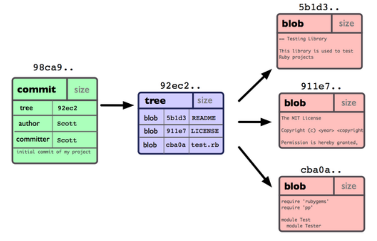

Figure 3.1: Single commit repository data

If you make some changes and commit again, the next commit stores a pointer to the commit that came im../mediately before it. After two more commits, your history might look something like Figure 3.2.


Figure 3.2: Git object data for multiple commits

A branch in Git is simply a lightweight movable pointer to one of these commits.The default branch name in Git is master. As you initially make commits, you’re given a master branch that points to the last commit you made. Every time you commit, it moves forward automatically. 

What happens if you create a new branch? Well, doing so creates a new pointer for you to move around. Let’s say you create a new branch called testing. You do this with the ```git branch``` command:
```
$ git branch testing
```


Figure 3.3: Branch pointing into the commit data's history
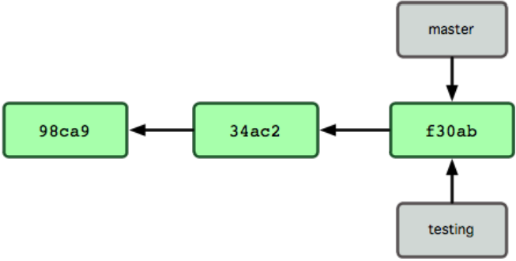

Figure 3.4: Multiple branches pointing into the commit's data history

This creates a new pointer at the same commit you’re currently on (see Figure 3.4).

How does Git know what branch you're currently on? It keeps a special pointer called HEAD. Note that this is a lot different than the concept of HEAD in other VCSs you may be used to, such as Subversion or CVS. In Git, this is a pointer to the local branch you’re currently on. In this case, you’re still on master. The git branch command only created a new branch — it didn't switch to that branch (see Figure 3.5).


Figure 3.5: HEAD file pointing to the branch you're on

To switch to an existing branch, you run the git checkout command. Let's switch to the new testing branch:
```
$ git checkout testing
```
This moves HEAD to point to the testing branch (see Figure 3.6).
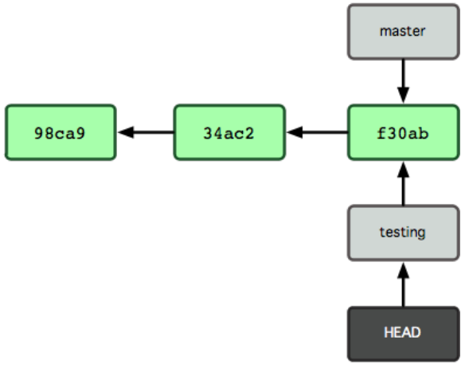

Figure 3.6: HEAD points to another branch when you switch branches.

What is the significance of that? Well, let's do another commit:
```
$ vim test.rb $ git commit -a -m 'made a change'
```


Figure 3.7: The branch that HEAD points to moves forward with each commit.

This is interesting, because now your testing branch has moved forward, but your master branch still points to the commit you were on when you ran git checkout to switch branches. Let's switch back to the master branch:
```
$ git checkout master
```


Figure 3.8: HEAD moves to another branch on a checkout.

Figure 3.8 shows the result. That command did two things. It moved the HEAD pointer back to point to the master branch, and it reverted the files in your working directory back to the snapshot that master points to. This also means the changes you make from this point forward will diverge from an older version of the project. It essentially rewinds the work you’ve done in your testing branch temporarily so you can go in a different direction. 

Let's make a few changes and commit again:
```
$ vim test.rb
$ git commit -a -m 'made other changes'
```
Now your project history has diverged (see Figure 3.9). You created and switched to a branch, did some work on it, and then switched back to your main branch and did other work. Both of those changes are isolated in separate branches: you can switch back and forth between the branches and merge them together when you’re ready. And you did all that with simple branch and checkout commands.


Figure 3.9: The branch histories have diverged.

Because a branch in Git is in actuality a simple file that contains the 40 character SHA–1 checksum of the commit it points to, branches are cheap to create and destroy. Creating a new branch is as quick and simple as writing 41 bytes to a file (40 characters
 and a newline).

This is in sharp contrast to the way most VCS tools branch, which involves copying all of the project's files into a second directory. This can take several seconds or even minutes, depending on the size of the project, whereas in Git the process is always instantaneous. Also, because we're recording the parents when we commit, finding a proper merge base for merging is automatically done for us and is generally very easy to do. These features help encourage developers to create and use branches often. 

Let's see why you should do so.

Basic Branching and Merging
----------------------
Let’s go through a simple example of branching and merging with a workflow that you might use in the real world. You'll follow these steps:

1. Do work on a web site.
2. Create a branch for a new story you're working on.
3. Do some work in that branch.

At this stage, you'll receive a call that another issue is critical and you need a hotfix. You'll do the following:

1. Revert back to your production branch.
2. Create a branch to add the hotfix.
3. After it's tested, merge the hotfix branch, and push to production.
4. Switch back to your original story and continue working.

### Basic Branching
First, let's say you're working on your project and have a couple of commits already (see Figure 3.10).


Figure 3.10: A short and simple commit history

You've decided that you're going to work on issue #53 in whatever issue-tracking system your company uses. To be clear, Git isn’t tied into any particular issue-tracking system; but because issue #53 is a focused topic that you want to work on, you’ll create a new branch in which to work. To create a branch and switch to it at the same time, you can run the ```git checkout``` command with the ```-b``` switch:
```
$ git checkout -b iss53 
Switched to a new branch "iss53"
```
This is shorthand for
```
$ git branch iss53
$ git checkout iss53
```


Figure 3.11: Creating a new branch pointer

You work on your web site and do some commits. Doing so moves the ```iss53``` branch forward, because you have it checked out (that is, your HEAD is pointing to it; see Figure 3.12):
```
$ vim index.html
$ git commit -a -m 'added a new footer [issue 53]'
```

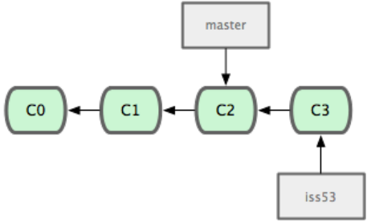

Figure 3.12: The iss53 branch has moved forward with your work.

Now you get the call that there is an issue with the web site, and you need to fix it im../mediately. im../mediately. With Git, you don’t have to deploy your fix along with the ```iss53``` changes you've made, and you don't have to put a lot of effort into reverting those changes before you can work on applying your fix to what is in production. All you have to do is switch back to your master branch. 

However, before you do that, note that if your working directory or staging area has uncommitted changes that conflict with the branch you're checking out, Git won't let you switch branches. It’s best to have a clean working state when you switch branches. There are ways to get around this (namely, stashing and commit amending) that we'll cover later. For now, you've committed all your changes, so you can switch back to your master branch:
```
$ git checkout master
Switched to branch "master"
```

At this point, your project working directory is exactly the way it was before you started working on issue #53, and you can concentrate on your hotfix. This is an important point to remember: Git resets your working directory to look like the snapshot of the commit that the branch you check out points to. It adds, removes, and modifies files automatically to make sure your working copy is what the branch looked like on your last commit to it.

Next, you have a hotfix to make. Let’s create a hotfix branch on which to work unti it's completed (see Figure 3.13):

```
$ git checkout -b ’hotfix’
Switched to a new branch "hotfix"
$ vim index.html
$ git commit -a -m ’fixed the broken email address’
[hotfix]: created 3a0874c: "fixed the broken email address"
  1 files changed, 0 insertions(+), 1 deletions(-)
```
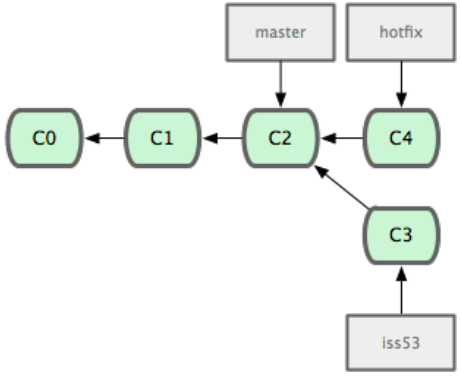

Figure 3.13: hotfix branch based back at your master branch point

You can run your tests, make sure the ```hotfix``` is what you want, and merge it back into your master branch to deploy to production. You do this with the git merge command:

```
$ git checkout master
$ git merge hotfix
Updating f42c576..3a0874c
Fast forward
  README | 1 -
  1 files changed, 0 insertions(+), 1 deletions(-)
```

You’ll notice the phrase "Fast forward" in that merge. Because the commit pointed to by the branch you merged in was directly upstream of the commit you're on, Git moves the pointer forward. To phrase that another way, when you try to merge one commit with a commit that can be reached by following the first commit's history, Git simplifies things by moving the pointer forward because there is no divergent work to merge together — this is called a "fast forward". 

Your change is now in the snapshot of the commit pointed to by the ```master``` branch, and you can deploy your change (see Figure 3.14).

After that your super-important fix is deployed, you're ready to switch back to the work you were doing before you were interrupted. However, first you'll delete the

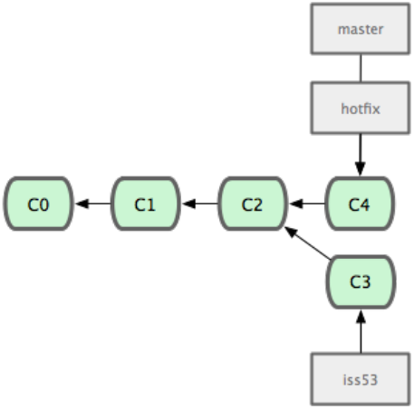

Figure 3.14: Your master branch points to the same place as your ```hotfix``` branch after the merge.

```hotfix``` branch, because you no longer need it — the master branch points at the same place. You can delete it with the ```-d``` option to ```git branch```:

```
$ git branch -d hotfix
Deleted branch hotfix (3a0874c).
```

Now you can switch back to your work-in-progress branch on issue #53 and continue working on it (see Figure 3.15):

```
$ git checkout iss53
Switched to branch "iss53"
$ vim index.html
$ git commit -a -m ’finished the new footer [issue 53]’
 [iss53]: created ad82d7a: "finished the new footer [issue 53]"
  1 files changed, 1 insertions(+), 0 deletions(-)
```


Figure 3.15: Your ```iss53``` branch can move forward independently.

It's worth noting here that the work you did in your ```hotfix``` branch is not contained in the files in your ```iss53``` branch. If you need to pull it in, you can merge your master branch into your iss53 branch by running ```git merge master```, or you can wait to integrate those changes until you decide to pull the ```iss53``` branch back into master later.

### Basic Merging
Suppose you've decided that your issue #53 work is complete and ready to be merged into your ```master``` branch. In order to do that, you'll merge in your ```iss53``` branch, much like you merged in your ```hotfix``` branch earlier. All you have to do is check out the branch you wish to merge into and then run the ```git merge``` command:
```
$ git checkout master
$ git merge iss53
Merge made by recursive.
  README | 1 +
  1 files changed, 1 insertions(+), 0 deletions(-)
```
This looks a bit different than the ```hotfix``` merge you did earlier. In this case, your development history has diverged from some older point. Because the commit on the branch you're on isn't a direct ancestor of the branch you're merging in, Git has to do some work. In this case, Git does a simple three-way merge, using the two snapshots pointed to by the branch tips and the common ancestor of the two. Figure 3.16 highlights the three snapshots that Git uses to do its merge in this case.

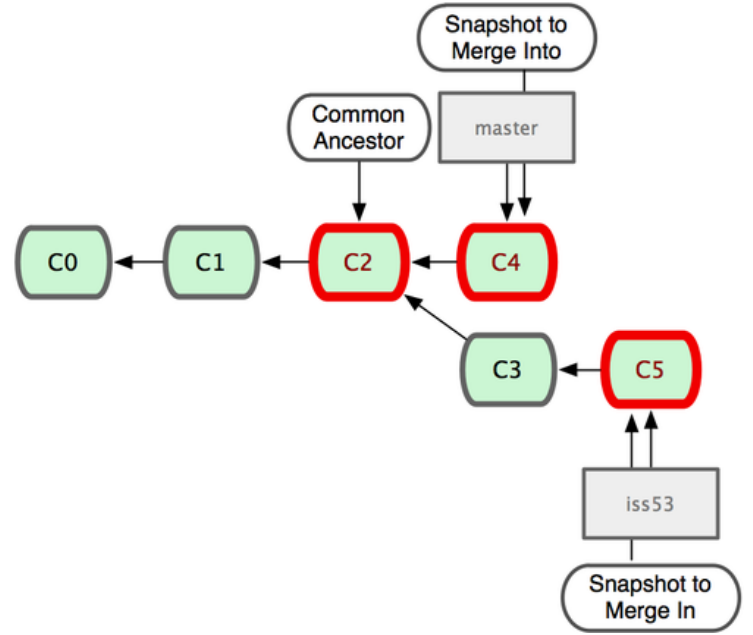

Figure 3.16: Git automatically identifies the best common-ancestor merge base for branch merging.

Instead of just moving the branch pointer forward, Git creates a new snapshot that results from this three-way merge and automatically creates a new commit that points to it (see Figure 3.17). This is referred to as a merge commit and is special in that it has more than one parent. It's worth pointing out that Git determines the best common ancestor to use for its merge base; this is different than CVS or Subversion (before version 1.5), where the developer doing the merge has to figure out the best merge base for themselves. This makes merging a heck of a lot easier in Git than in these other systems. Now that your work is merged in, you have no further need for the iss53 branch. You can delete it and then manually close the ticket in your ticket-tracking system:

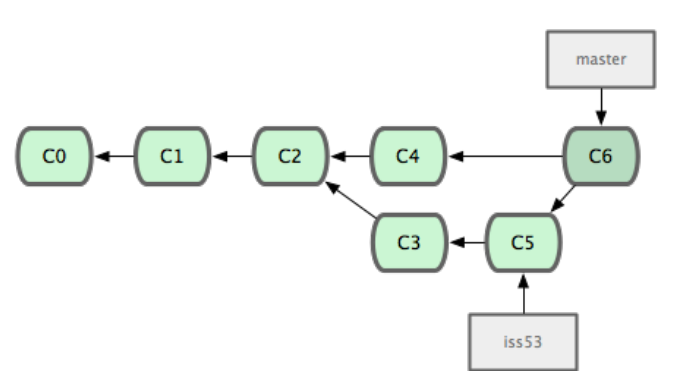

Figure 3.17: Git automatically creates a new commit object that contains the merged work.
```
$ git branch -d iss53
```
### Basic Merge Conflicts
Occasionally, this process doesn't go smoothly. If you changed the same part of the same file differently in the two branches you're merging together, Git won't be able to merge them cleanly. If your fix for issue #53 modified the same part of a file as the ```hotfix```, you'll get a merge conflict that looks something like this:

```
$ git merge iss53
Auto-merging index.html
CONFLICT (content): Merge conflict in index.html
Automatic merge failed; fix conflicts and then commit the result.
```

Git hasn't automatically created a new merge commit. It has paused the process while you resolve the conflict. If you want to see which files are unmerged at any point after a merge conflict, you can run git status:
```
[master*]$ git status index.html: needs merge
# On branch master
# Changed but not updated:
#   (use "git add <file>..." to update what will be committed)
#   (use "git checkout -- <file>..." to discard changes in working directory)
# 
# unmerged: index.html
#
```
Anything that has merge conflicts and hasn't been resolved is listed as unmerged. Git adds standard conflict-resolution markers to the files that have conflicts, so you can open them manually and resolve those conflicts. Your file contains a section that looks something like this:

```
<<<<<<< HEAD:index.html
<div id="footer">contact : email.support@github.com</div>
=======
<div id="footer">
    please contact us at support@github.com
</div> >>>>>>> iss53:index.html
```
This means the version in HEAD (your master branch, because that was what you had checked out when you ran your merge command) is the top part of that block (everything above the ```=======```), while the version in your iss53 branch looks like everything in the bottom part. In order to resolve the conflict, you have to either choose one side or the other or merge the contents yourself. For instance, you might resolve this conflict by replacing the entire block with this:
```
<div id="footer">
    please contact us at email.support@github.com
</div>
```
This resolution has a little of each section, and I've fully removed the ```<<<<<<<```, ```=======```, and ```>>>>>>>``` lines. After you've resolved each of these sections in each conflicted file, run ```git add``` on each file to mark it as resolved. Staging the file marks it as resolved in Git. If you want to use a graphical tool to resolve these issues, you can run ```git mergetool```, which fires up an appropriate visual merge tool and walks you through the conflicts:

```
$ git mergetool
merge tool candidates: kdiff3 tkdiff xxdiff meld gvimdiff opendiff emerge vimdiff
Merging the files: index.html

Normal merge conflict for ’index.html’:
    {local}: modified
    {remote}: modified
Hit return to start merge resolution tool (opendiff):
```

If you want to use a merge tool other than the default (Git chose ```opendiff``` for me in this case because I ran the command on a Mac), you can see all the supported tools listed at the top after "merge tool candidates". Type the name of the tool you'd rather use. In Chapter 7, we'll discuss how you can change this default value for your environment.

After you exit the merge tool, Git asks you if the merge was successful. If you tell the script that it was, it stages the file to mark it as resolved for you.

You can run ```git status``` again to verify that all conflicts have been resolved:
```
$ git status
# On branch master
# Changes to be committed:
# (use "git reset HEAD <file>..." to unstage)
# 
# modified: index.html 
#
```
If you’re happy with that, and you verify that everything that had conflicts has been staged, you can type ```git commit``` to finalize the merge commit. The commit message by default looks something like this:
```
Merge branch 'iss53'

Conflicts:
  index.html
# 
# It looks like you may be committing a MERGE.
# If this is not correct, please remove the file
# .git/MERGE_HEAD
# and try again.
# 
```
You can modify that message with details about how you resolved the merge if you think it would be helpful to others looking at this merge in the future — why you did what you did, if it's not obvious.

BranchManagement
-----------------
Now that you’ve created, merged, and deleted some branches, let’s look at some branch management tools that will come in handy when you begin using branches all the time.

The ```git branch``` command does more than just create and delete branches. If you run it with no arguments, you get a simple listing of your current branches:
```
$ git branch
  iss53
* master
  testing
```
Notice the ```*``` character that prefixes the ```master``` branch: it indicates the branch that you currently have checked out. This means that if you commit at this point, the ```master``` branch will be moved forward with your new work. To see the last commit on each branch, you can run ```git branch -v```:
```
$ git branch -v
  iss53 93b412c fix javascript issue
* master 7a98805 Merge branch ’iss53’
  testing 782fd34 add scott to the author list in the readmes
```
Another useful option to figure out what state your branches are in is to filter this list to branches that you have or have not yet merged into the branch you're currently on. The useful ```--merged``` and ```--no-merged``` options have been available in Git since version 1.5.6 for this purpose. To see which branches are already merged into the branch you’re on, you can run ```git branch merged```:

```
$ git branch --merged 
  iss53
* master
```
Because you already merged in ```iss53``` earlier, you see it in your list. Branches on this list without the ```*``` in front of them are generally fine to delete with ```git branch -d```; you’ve already incorporated their work into another branch, so you’re not going to lose anything.

To see all the branches that contain work you haven't yet merged in, you can run ```git branch --no-merged```:
```
$ git branch --no-merged 
  testing
```
This shows your other branch. Because it contains work that isn't merged in yet, trying to delete it with ```git branch -d``` will fail:
```
$ git branch -d testing
error: The branch 'testing' is not an ancestor of your current HEAD.
```
If you are sure you want to delete it, run ```git branch -D testing```. If you really do want to delete the branch and lose that work, you can force it with ```-D```, as the helpful message points out.

Branching Work flows
------------
Now that you have the basics of branching and merging down, what can or should you do with them? In this section, we'll cover some common workflows that this lightweight branching makes possible, so you can decide if you would like to incorporate it into your own development cycle.

#TODO
### Long-Running Branches
Because Git uses a simple three-way merge, merging from one branch into another multiple times over a long period is generally easy to do. This means you can have several branches that are always open and that you use for different stages of your development cycle; you can merge regularly from some of them into others.

Many Git developers have a workflow that embraces this approach, such as having only code that is entirely stable in their master branch — possibly only code that has been or will be released. They have another parallel branch named develop or next that they work from or use to test stability — it isn’t necessarily always stable, but whenever it gets to a stable state, it can be merged into master. It's used to pull in topic branches (short-lived branches, like your earlier iss53 branch) when they're ready, to make sure they pass all the tests and don't introduce bugs.

In reality, we're talking about pointers moving up the line of commits you're making. The stable branches are farther down the line in your commit history, and the bleeding-edge branches are farther up the history (see Figure 3.18).


Figure 3.18: More stable branches are generally farther down the commit history.

It’s generally easier to think about them as work silos, where sets of commits graduate to a more stable silo when they're fully tested (see Figure 3.19).

You can keep doing this for several levels of stability. Some larger projects also havea ```proposed``` or ```pu```  (proposed updates) branch that has integrated branches that may not be ready to go into the ```next``` or ```master``` branch. The idea is that your branches are at various levels of stability; when they reach a more stable level, they're merged into the branch above them. Again, having multiple long-running branches isn't necessary, but it's often helpful, especially when you're dealing with very large or complex projects.

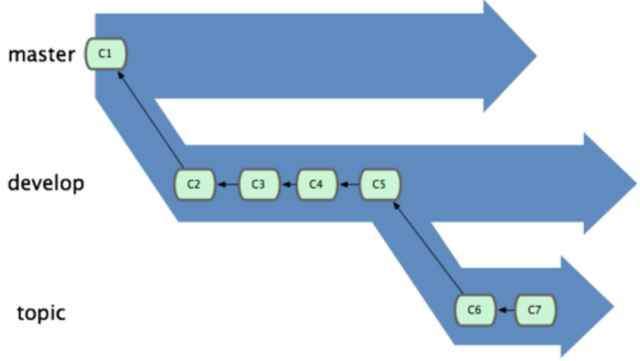

Figure 3.19: It may be helpful to think of your branches as silos.

### Topic Branches

Topic branches, however, are useful in projects of any size. A topic branch is a short-lived branch that you create and use for a single particular feature or related work. This is something you've likely never done with a VCS before because it's generally too expensive to create and merge branches. But in Git it's common to create, work on, merge, and delete branches several times a day. 

You saw this in the last section with the ```iss53``` and ```hotfix``` branches you created. You did a few commits on them and deleted them directly after merging them into your main branch. This technique allows you to context-switch quickly and completely — because your work is separated into silos where all the changes in that branch have to do with that topic, it's easier to see what has happened during code review and such. You can keep the changes there for minutes, days, or months, and merge them in when they're ready, regardless of the order in which they were created or worked on.

Consider an example of doing some work (on ```master```), branching off for an issue (```iss91```), working on it for a bit, branching off the second branch to try another way of handling the same thing (```iss91v2```), going back to your master branch and working there for a while, and then branching off there to do some work that you're not sure is a good idea (dumbidea branch). Your commit history will look something like Figure 3.20.

Now, let’s say you decide you like the second solution to your issue best (```iss91v2```); and you showed the dumbidea branch to your coworkers, and it turns out to be genius. You can throw away the original iss91 branch (losing commits C5 and C6) and merge in the other two. Your history then looks like Figure 3.21.

It's important to remember when you're doing all this that these branches are completely local. When you're branching and merging, everything is being done only in your Git repository — no server communication is happening.


Figure 3.20: Your commit history with multiple topic branches


Figure 3.21: Your history after merging in ```dumbidea``` and ```iss91v2```

Remote Branches
---------------
Remote branches are references to the state of branches on your remote repositories. They're local branches that you can't move; they're moved automatically whenever you do any network communication. Remote branches act as bookmarks to remind you where the branches on your remote repositories were the last time you connected to them.

They take the form ```(remote)/(branch)```. For instance, if you wanted to see what the ```master``` branch on your ```origin``` remote looked like as of the last time you communicated with it, you would check the ```origin/master``` branch. If you were working on an issue with a partner and they pushed up an ```iss53``` branch, you might have your own local ```iss53``` branch; but the branch on the server would point to the commit at ```origin/iss53```. 

This may be a bit confusing, so let's look at an example. Let's say you have a Git server on your network at ```git.ourcompany.com```. If you clone from this, Git automatically names it ```origin``` for you, pulls down all its data, creates a pointer to where its ```master``` branch is, and names it ```origin/master``` locally; and you can't move it. Git also gives you your own ```master``` branch starting at the same place as origin’s ```master``` branch, so you have something to work from (see Figure 3.22).

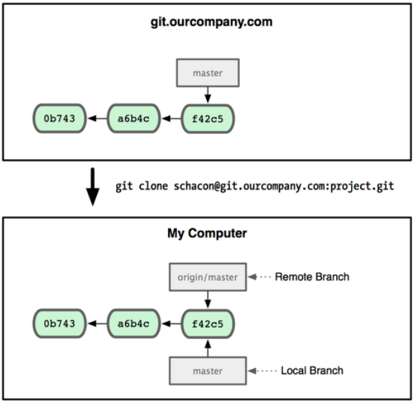
Figure3.22: A Git clone gives you your own master branch and origin/master pointing to origin’s master branch.

If you do some work on your local master branch, and, in the meantime, someone else pushes to git.ourcompany.com and updates its master branch, then your histories move forward differently. Also, as long as you stay out of contact with your origin server, your origin/master pointer doesn't move (see Figure 3.23).

To synchronize your work, you run a ```git fetch origin``` command. This command looks up which server origin is (in this case, it's ```git.ourcompany.com```), fetches any data from it that you don't yet have, and updates your local database, moving your origin/master pointer to its new, more up-to-date position (see Figure 3.24). 

To demonstrate having multiple remote servers and what remote branches for those remote projects look like, let’s assume you have another internal Git server that is used only for development by one of your sprint teams. This server is at ```git.team1.ourcompany.com```. You can add it as a new remote reference to the project you’re currently working on by running the ```git remote add``` command as we covered in Chapter 2. Name this remote ```teamone```, which will be your shortname for that whole URL (see Figure 3.25).


Figure 3.23: Working locally and having someone push to your remote server makes each history move forward differently.


Figure 3.24: The git fetch command updates your remote references.

Now, you can run ```git fetch teamone``` to fetch everything server has that you don't have yet. Because that server is a subset of the data your ```origin``` server has right now, Git fetches no data but sets a remote branch called ```teamone/master``` to point to the commit that ```teamone``` has as its ```master``` branch (see Figure 3.26).


Figure 3.25: Adding another server as a remote


Figure 3.26: You get a reference to teamone's master branch position locally.

### Pushing 
When you want to share a branch with the world, you need to push it up to a remote that you have write access to. Your local branches aren’t automatically synchronized to the remotes you write to — you have to explicitly push the branches you want to share. That way, you can use private branches do work you don't want to share, and push up only the topic branches you want to collaborate on.

If you have a branch named ```serverfix``` that you want to work on with others, you can push it up the same way you pushed your first branch. Run ```git push (remote) (branch)```:
```
$ git push origin serverfix
Counting objects: 20, done.
Compressing objects: 100% (14/14), done.
Writing objects: 100% (15/15), 1.74 KiB, done.
Total 15 (delta 5), reused 0 (delta 0)
To git@github.com:schacon/simplegit.git
 * [new branch]   serverfix   -> serverfix
```

This is a bit of a shortcut. Git automatically expands the ```serverfix``` branchname out to ```refs/heads/serverfix:refs/heads/serverfix```, which means, "Take my serverfix local branch and push it to update the remote's serverfix branch." We'll go over the ```refs/heads/``` part in detail in Chapter 9, but you can generally leave it off. You can also do ```git push origin serverfix:serverfix```, which does the same thing — it says, "Take my serverfix and make it the remote's serverfix." You can use this format to push a local branch into a remote branch that is named differently. If you didn't want it to be called ```serverfix``` on the remote, you could instead run ```git push origin serverfix:awesomebranch``` to push your local serverfix branch to the ```awesomebranch``` branch on the remote project.

The next time one of your collaborators fetches from the server, they will get a reference to where the server's version of ```serverfix``` is under the remote branch ```origin/serverfix```:

```
$ git fetch origin
remote: Counting objects: 20, done.
remote: Compressing objects: 100% (14/14), done.
remote: Total 15 (delta 5), reused 0 (delta 0)
Unpacking objects: 100% (15/15), done.
From git@github.com:schacon/simplegit
 * [new branch]   serverfix   -> origin/serverfix
```

It's important to note that when you do a fetch that brings down new remote branches, you don't automatically have local, editable copies of them. In other words, inthiscase,you don’t have a new ```serverfix``` branch — you only have an ```origin/serverfix``` pointer that you can't modify.

To merge this work into your current working branch, you can run ```git merge origin/serverfix```. If you want your own serverfix branch that you can work on, you can base it off your remote branch:

```
$ git checkout -b serverfix origin/serverfix
Branch serverfix set up to track remote branch refs/remotes/origin/serverfix.
Switched to a new branch "serverfix"
```

This gives you a local branch that you can work on that starts where ```origin/serverfix``` is.

### Tracking Branches
Checking out a local branch from a remote branch automatically creates what is called a *tracking branch*. Tracking branches are local branches that have a direct relationship to a remote branch. If you're on a tracking branch and type ```git push```, Git automatically knows which server and branch to push to. Also, running ```git pull``` while on one of these branches fetches all the remote references and then automatically merges in the corresponding remote branch.
When you clone a repository, it generally automatically creates a ```master``` branch that tracks origin/master. That's why ```git push``` and ```git pull``` work out of the box with no other arguments. However, you can set up other tracking branches if you wish — ones that don't track branches on ```origin``` and don't track the master branch. The simple case is the example you just saw, running ```git checkout -b [branch][remotename]/[branch]```. If you have Git version 1.6.2 or later, you can also use the --track shorthand:

```
$ git checkout --track origin/serverfix Branch serverfix set up to track remote branch refs/remotes/origin/serverfix. Switched to a new branch "serverfix"
```
To set up a local branch with a different name than the remote branch, you can easily use the first version with a different local branch name:

```
$ git checkout -b sf origin/serverfix
Branch sf set up to track remote branch refs/remotes/origin/serverfix.
Switched to a new branch "sf"
```

Now, your local branch sf will automatically push to and pull from ```origin/serverfix```.


### Deleting Remote Branches

Suppose you're done with a remote branch — say, you and your collaborators are finished with a feature and have merged it into your remote's ```master``` branch (or whatever branch your stable codeline is in). You can delete a remote branch using the rather obtuse syntax git push [remotename] :[branch]. If you want to delete your serverfix branch from the server, you run the following:

```
$ git push origin :serverfix\
To git@github.com:wingadium1/simplegit.git
  - [deleted] serverfix
```
Boom. No more branch on your server. You may want to dog - ear this page, because you'll need that command,and you'll likely forget the syntax. Away to remember this command is by recalling the ```git push [remotename] [localbranch]:[remotebranch]``` syntax that we went over a bit earlier. If you leave off the ```[localbranch]``` portion, then you're basically saying, "Take nothing on my side and make it be ```[remotebranch]```."

Rebasing
------

In Git, there are two main ways to integrate changes from one branch into another: the merge and the rebase. In this section you'll learn what rebasing is, how to do it, why it's a pretty amazing tool, and in what cases you won't want to use it.

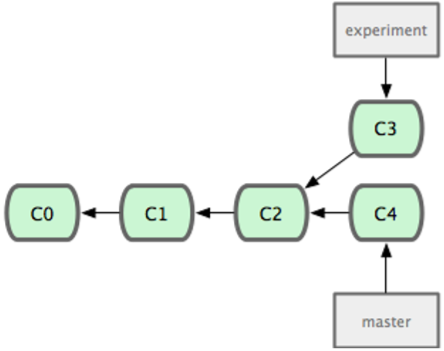

Figure 3.27: Your initial diverged commit history

### The Basic Rebase
If you go back to an earlier example from the Merge section (see Figure 3.27), you can see that you diverged your work and made commits on two different branches.

The easiest way to integrate the branches, as we've already covered, is the merge command. It performs a three-way merge between the two latest branch snapshots (C3 and C4) and the most recent common ancestor of the two (C2), creating a new snapshot (and commit), as shown in Figure 3.28.

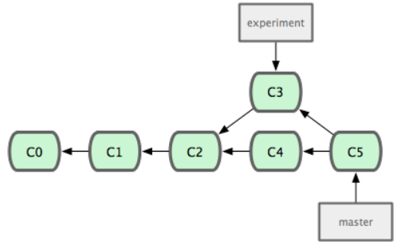

Figure 3.28: Merging a branch to integrate the diverged work history

However, there is another way: you can take the patch of the change that was introduced in C3 and reapply it on top of C4. In Git, this is called *rebasing*. With the ```rebase``` command, you can take all the changes that were committed on one branch and replay them on another one. In this example, you'd run the following:
```
$ git checkout experiment
$ git rebase master
First, rewinding head to replay your work on top of it...
Applying: added staged command
```
It works by going to the common ancestor of the two branches (the one you're on and the one you're rebasing onto), getting the diff introduced by each commit of the branch you're on, saving those diffs to temporary files, resetting the current branch to the same commit as the branch you are rebasing onto, and finally applying each change in turn. Figure 3.29 illustrates this process.


Figure 3.29: Rebasing the change introduced in C3 onto C4

At this point, you can go back to the master branch and do a fast-forward merge (see Figure 3.30).


Figure 3.30: Fast-forwarding the master branch

Now, the snapshot pointedto by C3 is exactly thesame as theone that waspointed to by C5 in the merge example. There is no difference in the end product of the integration, but rebasing makes for a cleaner history. If you examine the log of a rebased branch, it looks like a linear history: it appears that all the work happened in series, even when it originally happened in parallel.

Often, you'll do this to make sure your commits apply cleanly on a remote branch — perhaps in a project to which you're trying to contribute but that you don't maintain. In this case, you'd do your work in a branch and then rebase your work onto ```origin/master``` when you were ready to submit your patches to the main project. That way, the maintainer doesn't have to do any integration work — just a fast-forward or a clean apply.

Note that the snapshot pointed to by the final commit you end up with, whether it’s the last of the rebased commits for a rebase or the final merge commit after a merge, is the same snapshot — it's only the history that is different. Rebasing replays changes from one line of work onto another in the order they were introduced, whereas merging takes the endpoints and merges them together.

### More Interesting Rebases
You can also have your rebase replay on something other than the rebase branch. Take a history like Figure 3.31, for example. You branched a topic branch (```server```) to add some server-side functionality to your project, and made a commit. Then, you branched off that to make the client-side changes (```client```) and committed a few times. Finally, you went back to your server branch and did a few more commits.


Figure 3.31: A history with a topic branch off another topic branch

Suppose you decide that you want to merge your client-side changes into your mainline for a release, but you want to hold off on the server-side changes until it's tested further. You can take the changes on client that aren’t on server (C8 and C9) and replay them on your master branch by using the ```--onto``` option of ```git rebase```:
``
$ git rebase --onto master server client
``
This basically says, "Check out the client branch, figure out the patches from the common ancestor of the ```client``` and ```server``` branches, and then replay them onto ```master```." It's a bit complex; but the result, shown in Figure 3.32, is pretty cool.

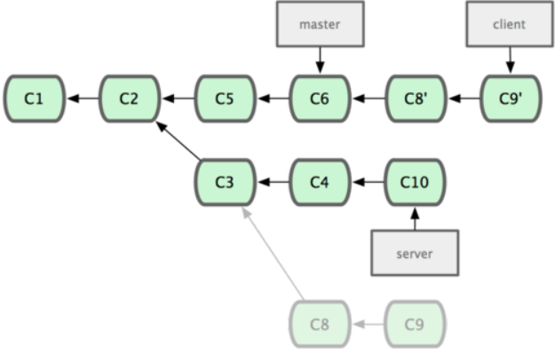

Figure 3.32: Rebasing a topic branch off another topic branch

Now you can fast-forward your master branch (see Figure 3.33):
```
$ git checkout master
$ git merge client
```
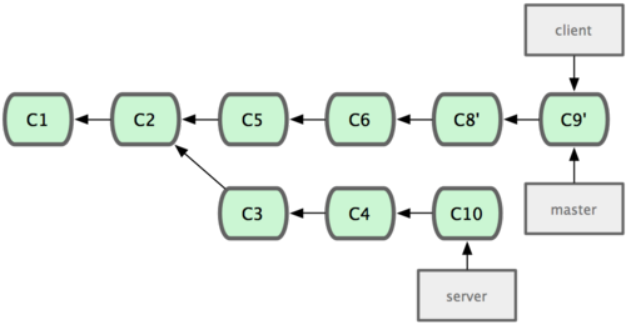

Figure 3.33: Fast-forwarding your master branch to include the client branch changes

Let's say you decide to pull in your server branch as well. You can rebase the server branch onto the master branch without having to check it out first by running ```git rebase [basebranch] [topicbranch]``` — which checks out the topic branch (in this case, ```server```) for you and replays it onto the base branch (```master```):
```
$ git rebase master server
```
This replays your server work on top of your ```master``` work, as shown in Figure 3.34.


Figure 3.34: Rebasing your server branch on top of your master branch

Then, you can fast-forward the base branch (```master```):

```
$ git checkout master
$ git merge server
```
You can remove the client and server branches because all the work is integrated and you don't need them anymore, leaving your history for this entire process looking like Figure 3.35:
```
$ git branch -d client
$ git branch -d server
```


Figure 3.35: Final commit history

### The Perils of Rebasing
Ahh, but the bliss of rebasing isn't without its drawbacks, which can be summed up in a single line: 
> **Do not rebase commits that you have pushed to a public repository.**

If you follow that guideline, you'll be fine. If you don't, people will hate you, and you'll be scorned by friends and family.

When you rebase stuff, you’re abandoning existing commits and creating new ones that are similar but different. If you push commits somewhere and others pull them down and base work on them, and then you rewrite those commits with git rebase and push them up again, your collaborators will have to re-merge their work and things will get messy when you try to pull their work back into yours.

Let's look at an example of how rebasing work that you've made public can cause problems. Suppose you clone from a central server and then do some work off that. Your commit history looks like Figure 3.36.

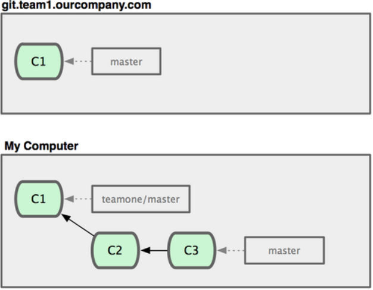

Figure 3.36: Clone a repository, and base some work on it.

Now, someone else does more work that includes a merge, and pushes that work to the central server. You fetch them and merge the new remote branch into your work, making your history look something like Figure 3.37.

Next, the person who pushed the merged work decides to go back and rebase their work instead; they do a ```git push --force``` to overwrite the history on the server. You then fetch from that server, bringing down the new commits.

At this point, you have to merge this work in again, even though you've already done so. Rebasing changes the SHA–1 hashes of these commits so to Git they look like new commits, when in fact you already have the C4 work in your history (see Figure 3.39).

You have to merge that work in at some point so you can keep up with the other developer in the future. After you do that, your commit history will contain both the C4 and C4’ commits, which have different SHA–1 hashes but introduce the same work and have the same commit message. If you run a ```git log``` when your history looks like this, you'll see two commits that have the same author date and message, which will be confusing. Furthermore, if you push this history back up to the server, you'll reintroduce all those rebased commits to the central server, which can further confuse people.

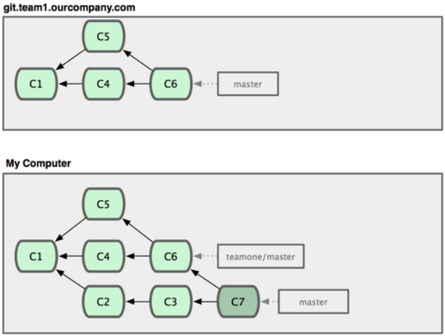

Figure 3.37: Fetch more commits, and merge them into your work.

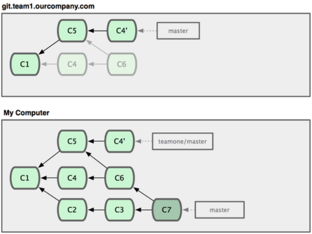

Figure 3.38: Someone pushes rebased commits, abandoning commits you've based your work on.


If you treat rebasing as a way to clean up and work with commits before you push them, and if you only rebase commits that have never been available publicly, then you'll be fine. If you rebase commits that have already been pushed publicly, and people may have based work on those commits, then you may be in for some frustrating trouble.

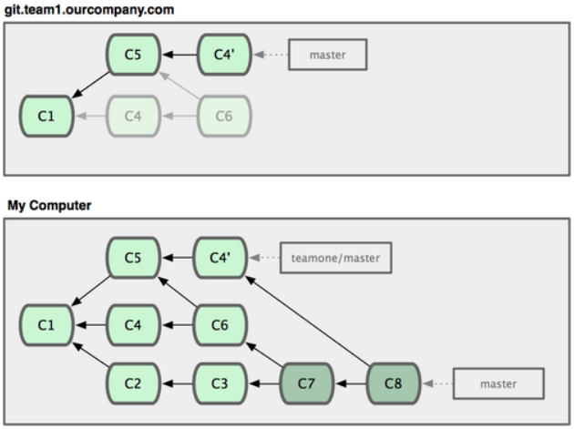

Figure 3.39: You merge in the same work again into a new merge commit.

Summary
---------

We've covered basic branching and merging in Git. You should feel comfortable creating and switching to new branches, switching between branches and merging local branches together. You should also be able to share your branches by pushing them to a shared server, working with others on shared branches and rebasing your branches before they are shared.
